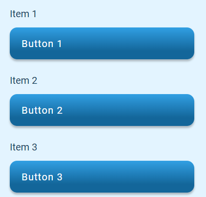

# Looping Data

In cases where data should be looped over to create a list of components, the `items` component can be used to define items to loop over and provide dynamic references to the item from within child components.

For example, we could create a datalist with the following data

| id        | title     | button_text   | link      |		
| --------- |---------  |-------------- |---------  | 
| item_1	| Item 1	| Button 1	    | link_1    |
| item_2	| Item 2	| Button 2	    | link_2    |
| item_3	| Item 3	| Button 3	    | link_3    |

Then, in order to loop over the data in a template simply create an items block referencing the datalist

| type          | name              | value                     | action_list       |		
| ---------     |---------          |--------------             |---------          | 
| begin_items	| items	            | @data.feature_items_data	|                   |
| text	        | text_@item.id	    | Button 2	                |                   |
| button	    | button_@item.id	| @item.title               | click | go_to: @item.link    |
| end_items	    | 	                | 	                        |                   |

Anything inside the items will be looped over and created for each item in the datalist.
To render item content refer to the `@item.` selector

!!! Tip
    You can use `@item` to help ensure unique names as well as providing dynamic text or actions 

We will render text and a button for each of the 3 items in the data list

[Google Sheet Demo](https://docs.google.com/spreadsheets/d/1LnKtclWcnbFs8vQKSUVCFd50IG81iZChb3VgRujpOrg/edit#gid=1745157248)   

[Live Preview Demo](https://plh-teens-app1.web.app/template/feature_items)

## Sort, filter and limit data
Looped data can also be piped with various operators to organise the final data output

<!-- TODO update docs -->
See notes in https://docs.google.com/document/d/1Pk2gYNhtu68XJo-U-h6RY8ZD8gOPaCnLOlCft4IjLY4/edit#

