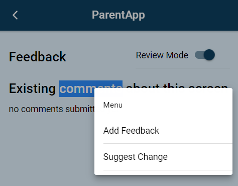

# Feedback

The feedback feature provides means by which users can provide contextual feedback within the app, such as a bug report, content suggestion or short survey

## Enabling Feedback
There are two ways of enabling feedback, either by globally enabling feedback mode, or opening a specific template as a feedback popup. See full list of actions below


## Template Actions
Various actions can be called from the templating system for use with the feedback module

| action            | description   |
| ---------         | ------------  |
| feedback:enable	| 	 |
| feedback:disable	| 	 |
| feedback:open	    | Open a template in feedback mode.	This will present a popup, which will submit as feedback any data passed from an `emit:completed` event |


## Context Menus
By default feedback options will be presented when the user carries out different *context* actions, such as right-click (web) on long-press (mobile) actions, as well as text selection.



Each of these actions can have multiple actions registered within a context menu, which can be used to launch an appropriate template. Actions contain the following fields:

| field             | description   |
| ---------         | ------------  |
| id	            | A unique identifier that will be used to register and unregister the menu action	 |
| menuButtonText	| Text to display in menu	 |
| appearInMenus	    | List of menus for action to appear in. Valid options are `rightClick`, `longPress` and `textSelect`	 |
| displayedTemplate	| Name of template to launch when button clicked	 |

The default buttons are registered in the `FEEDBACK_MODULE_DEFAULTS` constant. For the example screenshot above the configuration would be:

```ts
[
    {
      id: "feedback-addFeedback",
      menuButtonText: "Add Feedback",
      appearInMenus: ["rightClick", "longPress", "textSelect"],
      displayedTemplate: "feature_feedback_default",
    },
    {
      id: "feedback-suggestChange",
      menuButtonText: "Suggest Change",
      appearInMenus: ["textSelect"],
      displayedTemplate: "feature_feedback_text_select",
    },
  ]
```

!!! Tip
    The same feedback button can be used in multiple context menus, and similarly each context menu can have multiple buttons that link to different templates

## Submitting Feedback
The launched template should at a minimum contain an input box for users to record their feedback and a submit button that emits a `completed` event. Feedback will be sent to the server following trigger of the emit:completed action.

Any data to be submitted should be included with the emit event and an additional argument. Here is an example of a template that will submit feedback typed into a text_area by the user and stored as the `@local.feedback` variable.

|type               |	name	        |   value   |	action_list |
| ---------         | ------------      | --------- | ------------  |
|title              |	title_1	Feedback|	        |               |
|text_area          |	feedback		|           |               |
|begin_display_group|	dg_buttons		|           |               |
|button             |	button_cancel   |	Cancel  |	click &#124 emit:uncompleted;   |
|button             |	button_submit   |	Submit  |	==click &#124 emit:completed:@local.feedback;== |
|end_display_group  |	                |           |               |		

## Feedback Metadata
Alongside user-specified data various metadata will be added. See example output below

```json
{   
    "context":{
        "id": "feedback-suggestChange",
        "selectedText": "about this screen" // if menu triggered by textSelect this will be present
    },
    "feedback": "The feedback system works great!", // feedback returned by template
    "metadata": {
        "app_version": "0.13.0",
        "deviceInfo": {
            "model": "Windows NT 10.0",
            "platform": "web",
            "operatingSystem": "windows",
            "osVersion": "Windows NT 10.0; Win64; x64",
            "manufacturer": "Google Inc.",
            "isVirtual": false,
            "webViewVersion": "97.0.4692.71"
        },
        "envName": "dev",
        "pathname": "/feedback",
        "templateTarget": [
            {
                "name": "feedback_text_1",
                "type": "text"
            },
            {
                "templatename": "feedback_demo"
            }
        ],
        "timestamp": "2022-01-07T18:49:53",
        "uuid": "temp_auqm0orppvg"
    },
    
}
```

## Debugging Feedback
The feedback module comes with a debugging page available at `/feedback`