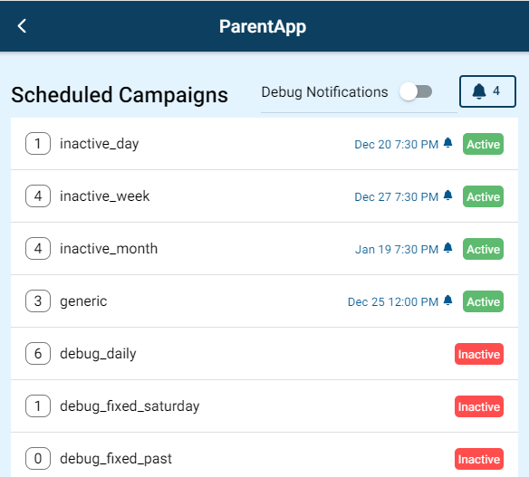
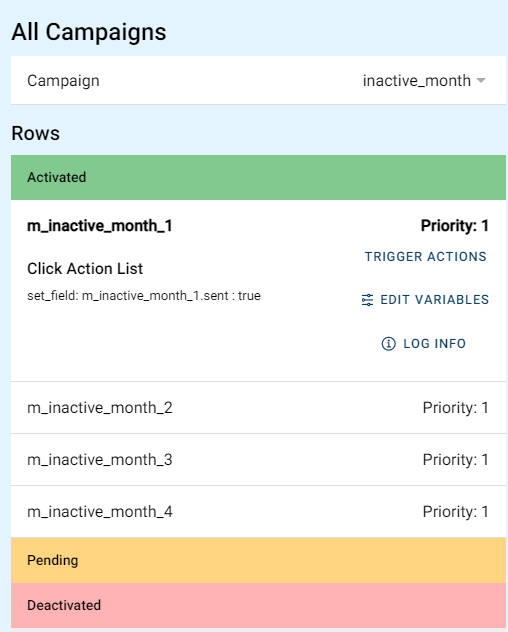
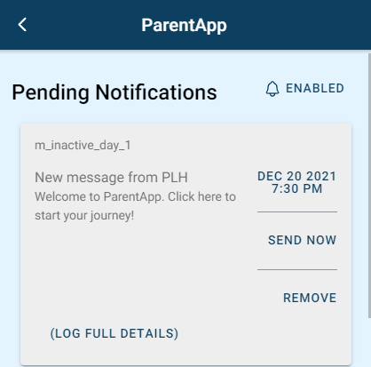

#  Notifications

Notifications can be authored to be sent from the app, and are handled from with the `Campaigns` system. Campaigns can contain schedules that determine when notifications should be sent (e.g. specific day/time-of-day) as well as rows that specify what to send. 

!!! Tip
    Campaigns only ever send one notification at their scheduled time, preventing the user being inundated with notifications if multiple are present in a campaign.

Here is an example of two rows added to a `==content_list==` for creating notifications. Information about the specific flow subtypes can be found below

| flow_type | flow_subtype      | flow_name |
| --------- | ------------      | --------- |
|data_list	| campaign_schedule	| example_campaign_schedule |
|data_list	| campaign_rows	    | example_campaign_rows |

## Campaign Schedule

| Column            | Description |
| -----------     | ----------- |
| id*                            | Unique identifier for schedule |
| activation_condition_list     | Conditions to evaluate for activating campaign. Must satisfy ALL |
| deactivation_condition_list   | Conditions to evaluate for deactivating campaign. Must not satisfy ANY |
| schedule.start_date           | Date of earliest notification. If in past will be ignored |
| schedule.end_date             | Date of latest notification. If in past will be ignored |
| schedule.day_of_week          | Send notifications weekly on a given day of the week (numbered from 1 - Monday, to 7 - Sunday) |
| schedule.batch_size           | Maximum number of notifications to schedule, e.g. if scheduling weekly specify number of weeks to pre-schedule |
| time.hour                     | Hour of day to send notifications on, in 24h format       |
| time.minute                   | Minute of day to send notification on |
| delay.days                    | Offset to schedule notification a given number of days from today |

The default settings for notifications will schedule a daily at 12pm. These settings are defined in the `NOTIFICATION_DEFAULTS` variable.

## Campaign Rows

| Column            | Description |
| -----------     | ----------- |
| **id**                            | Unique identifier for notification |
| activation_condition_list     | Conditions to evaluate for activating campaign. Must satisfy ALL |
| deactivation_condition_list   | Conditions to evaluate for deactivating campaign. Must not satisfy ANY |
| priority           | Number given to specify which notification should take priority when multiple active (highest priority sent sent) |
| campaign_list             | List of campaign schedules to include notifications in |
| text          | Send notifications weekly on a given day of the week (numbered from 1 - Monday, to 7 - Sunday) |
| title                     | Hour of day to send notifications on, in 24h format       |

## Advanced Topics

### Notification Debugging
The app provides a `/campaigns` page that can be used to provide an overview of currently scheduled campaigns and can be used to see which campaign schedules are active

Additionally an individual campaign can be examined to see all evaluated rows and their current status from the **All Campaigns** dropdown on the same page

Clicking the notification icon in the top-right will lead to another `/notifications` page that shows details of scheduled notifications

### Scheduling Frequency
Notifications are automatically evaluated and scheduled on app start

!!! warning
    When the app is not in active use sync timers pause and so no new notifications will be evaluated. That means that if the user closes the app 

There is currently no workaround for this unfortunately except for reducing the re-schedule sync timer, however if this is required than it is suggested to [create an issue](https://github.com/IDEMSInternational/parenting-app-ui/issues/new/choose) for the feature (likely best handled by a trigger that can be called from authoring).