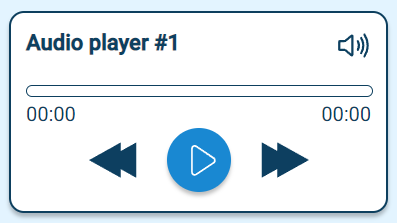

# Audio

Audio refers to any form of sound or sound-related content that can be played, recorded, processed or interacted within the app. Audio can include various types of sound such as music, spoken dialogue, sound effects and other auditory elements.

## Example

| type      | name          | value          |parameter_list |
| --------- | ------------  | ------         |--------- |
|audio	    | audio_1	      | test_audio.mp3 |title: "Audio player #1" |

[Google Sheet Demo](https://docs.google.com/spreadsheets/d/1ARbNRGDer5vj9qSpRMZFrMkYifGkH3TLtDVp72YbaqU/edit#gid=551506513)   
[Live Preview Demo](https://idems-debug.web.app/template/feature_audio)

## Parameters

| Parameter         | Default     | Description |
| ---------         | ----------- | --------- |
|title	            | Title     | Text to display at top of audio component|
|help	              | null        | Text to display within help-icon popup |
|range_bar_disabled	| false       | Prevent user interacting with playback bar|
|time_to_rewind	    | 15          | Default amount of time to rewind when pressing rewind button |