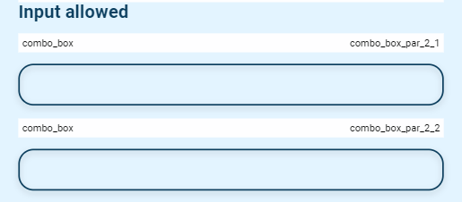

# Combo Box

## Example

| type       | name                      |parameter_list |
| ---------  | ------------              |--------- |
|combo_box   |combo_box_par_2_1	         |input_allowed: false; answer_list: @local.answer_list_1|
|combo_box   |combo_box_par_2_2	         |input_allowed: true; answer_list: @local.answer_list_1|

[Google Sheet Demo](https://docs.google.com/spreadsheets/d/1uIkaMlDjoDN7uTpHkSeEQ6Yp-4ehX9IrBQMrolpfjQc/edit#gid=569531329)   
[Live Preview Demo](https://plh-global.web.app/template/comp_box_box)

## Parameters

| Parameter             | Value                  | Description |
| ---------             | -----------            | --------- |
|answer_list            |null (default)          |No buttons presented|
|answer_list            |strings array           |List of buttons with parameters|
|input_allowed          |false (default)         |User can not set a custom response|
|input_allowed          |true                    |User can set a custom response|
|input_position         |top (default)           |Position of input element|
|input_position         |bottom                  |Position of input element|
|answer_placeholder     |string                  |Any input placeholder|
|placeholder            |string                  |Any placeholder for button open pop_up window|
|text                   |string                  |Text to appear on top|
