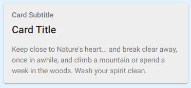

# HTML

## Example

| type      | name          | value                   |parameter_list |
| --------- | ------------  | ------                  |--------- |
|html	    | html_1	        | (see below)             |           |

Any valid html can be rendered in the value. This includes the full set of [Ionic Components](https://ionicframework.com/docs/components) used within the app, e.g.

```html
<ion-card>
  <ion-card-header>
    <ion-card-subtitle>Card Subtitle</ion-card-subtitle>
    <ion-card-title>Card Title</ion-card-title>
  </ion-card-header>
  <ion-card-content>
    Keep close to Nature's heart... and break clear away, once in awhile,
    and climb a mountain or spend a week in the woods. Wash your spirit clean.
  </ion-card-content>
</ion-card>
```  



[Google Sheet Demo](https://docs.google.com/spreadsheets/d/1-M10SxkDXoLCj3nQxkRdCMjqu7FgLIP55OYgvh4Oa-M/edit#gid=569531329)   
[Live Preview Demo](https://plh-teens-app1.web.app/template/comp_html)

## Parameters

| Parameter         | Default     | Description |
| ---------         | ----------- | --------- |

There are currently no supported parameters