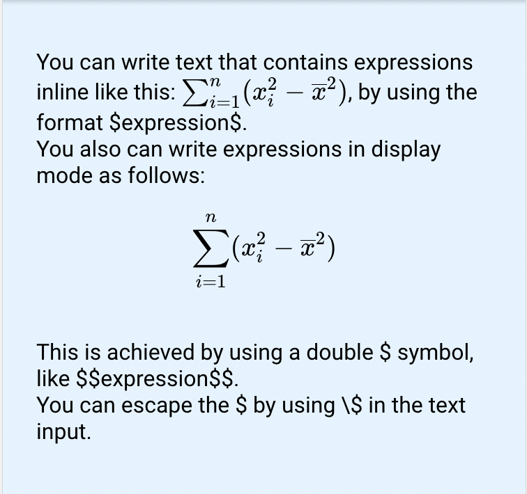

# LaTeX

## Example

| type      | name          | value                   |parameter_list |
| --------- | ------------  | ------                  |--------- |
|latex	    | latex_1	        | (see below)             |           |

Mathematical expressions written in LaTeX, or text containing such expressions, can be rendered in the value. For paragraphs containing LaTeX equations, two sets of delimiters are supported: authors can use either \$...\$ to delimit "inline" equations and \$\$...\$\$ to delimit "display" equations, or \(...\) can be used for inline and \\[...\\] for display. The example here uses the former pair of delimiters.

```latex
You can write text that contains expressions inline like this: $\sum_{i=1}^n(x_i^2 - \overline{x}^2)$, by using the format \$expression\$.
You also can write expressions in display mode as follows: $$\sum_{i=1}^n(x_i^2 - \overline{x}^2)$$
This is achieved by using a double \$ symbol, like \$\$expression\$\$.
You can escape the \$ by using \\$ in the text input.
```  



[Google Sheet Demo](https://docs.google.com/spreadsheets/d/1qPNAFQbrEQX8ZahmTr3LGhx3uoaooQJqVOAF2HHwmcg/)   
[Live Preview Demo](https://plh-teens-app1.web.app/template/comp_latex)

## Parameters

| Parameter         | Default     | Description |
| ---------         | ----------- | --------- |

There are currently no supported parameters