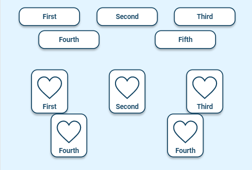

# Radio Group

A radio group allows users to select a single option from a list of mutually exclusive choices. It's typically used when there are multiple options available, but the user is allowed to select only one option at a time.

## Example

| type       | name              | value                                 |parameter_list |
| ---------  | ------------     | -------------------              |--------- |
| | answer_list_2 | name:name_var_1 \| text:First;name:name_var_2 \| text:Second;name:name_var_3 \| text:Third; name:name_var_4 \| text:Fourth;name:name_var_5 \| text:Fifth; | |
| | answer_list_3 | name:name_var_1 \| text:First \| image:/plh_images/icons/heart.svg \| image_checked: /plh_images/icons/tick.svg;name:name_var_2 \| text:Second \| image:/plh_images/icons/heart.svg \| image_checked: /plh_images/icons/tick.svg;name:name_var_3 \| text: Third \| image:/plh_images/icons/heart.svg \| image_checked: /plh_images/icons/tick.svg; name:name_var_4 \| text:Fourth \| image:/plh_images/icons/heart.svg \| image_checked: /plh_images/icons/tick.svg;name:name_var_5 \| text:Fourth \| image:/plh_images/icons/heart.svg \| image_checked: /plh_images/icons/tick.svg; | |
|radio_group |radio_group_par_2_1 | 	                     |answer_list: @local.answer_list_2|
|radio_group |radio_group_par_2_2 |              	     |answer_list: @local.answer_list_3|

[Google Sheet Demo](https://docs.google.com/spreadsheets/d/1qfatsiHKJ8sCBcJ8oqo3InLrjzT_a2Qxvw6RyxVMTxY/edit#gid=569531329)   
[Live Preview Demo](https://idems-debug.web.app/template/comp_radio_group)

## Parameters

| Parameter             | Value                  | Description |
| ---------             | -----------            | --------- |
|answer_list            |null (default)          |No buttons presented|
|answer_list            |strings array           |List of buttons with parameters|
|radio_button_type      |btn_text (default)      |To be removed|
|radio_button_type      |btn_square              |To be removed|
|radio_button_type      |btn_image_check         |To be removed|
|radio_button_type      |btn_image_nocheck       |To be removed|
|options_per_row        |2 (default)             |By default two buttons in one row|
|options_per_row        |number                  |Any number for buttons in one row|
|style	                |full (default)          |To be removed|
|style	                |standard (default)      |To be removed|
