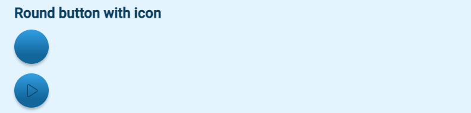

# Round button

## Example

| type        | name                                      |parameter_list |
| ---------   | ------------                         |--------- |
|round_button |round_button_par_2_1	 |icon_src: |
|round_button |round_button_par_2_2	     |icon_src: plh_images/icons/play.svg|

[Google Sheet Demo](https://docs.google.com/spreadsheets/d/161GZue4jkQNJzyfYvMWesMp2vwvbkJgpNqkDlVIGJDw/edit#gid=569531329)   
[Live Preview Demo](https://plh-global.web.app/template/comp_round_button)

## Parameters

| Parameter             | Value                  | Description |
| ---------             | -----------            | --------- |
|icon_src               |empty string (default)  |Button without an icon|
|icon_src               |string                  |Button with an icon. The `icon_src` can be a file path within the `global` subfolder of the assets folder or an icon in the [ionicons](https://ionic.io/ionicons) library|
|style                  |information (default)   |Button colour primary|
|style                  |navigation              |Button colour secondary with a smaller diameter|
|style                  |yellow                  |Button colour yellow|
|style                  |orange                  |Button colour orange|
|style                  |dark_orange             |Button colour dark orange|
|style                  |home_screen             |Button colour primary positioned to the right hand side of the screen|
|text                   |empty string (default)|No text on the button|
|text                   |string                  |Any string as a button text|
|disabled	            |false (default)         |To be removed|
|disabled	            |true                    |To be removed|
|starting_seconds       |0 - (default)           |To be removed|
|starting_seconds       |number                  |To be removed|
|ping                   | empty string (default)          |To be removed|     
|button_align           |center (default)        |To be removed|
|button_align           |left                    |To be removed|
|button_align           |right                   |To be removed|
