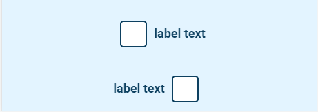

# Checkbox

## Example

| type            | name                    |parameter_list |
| ---------       | ------------            | ------        |                
|simple_checkbox  |simple_checkbox_par_3_1	|reverse: false; label_text: label text  |
|simple_checkbox  |simple_checkbox_par_3_2	|reverse: true; label_text: label text   |

[Google Sheet Demo](https://docs.google.com/spreadsheets/d/19t6lEBkVF0LV2dMD1yL6nbuUIFiiYNa0xLA1QQAyyxU/edit#gid=569531329)   
[Live Preview Demo](https://plh-teens-app1.web.app/template/comp_checkbox_button)

## Parameters

| Parameter             | Value                | Description |
| ---------             | -----------          | --------- |
|align	                |center (default)      | The alignment of the simple checkbox on the screen is centred|
|align	                |left                  | The alignment of the simple checkbox on the screen is left|
|align                  |right                 | The alignment of the simple checkbox on the screen is right|
|label_text             |null (default)        | No label text for simple checkbox|
|label_text             |string                | Label text for simple checkbox|
|style                  |empty string (default)| To be removed|
|reverse                |false (default)       | To be removed|
|reverse                |true                  | To be removed|
