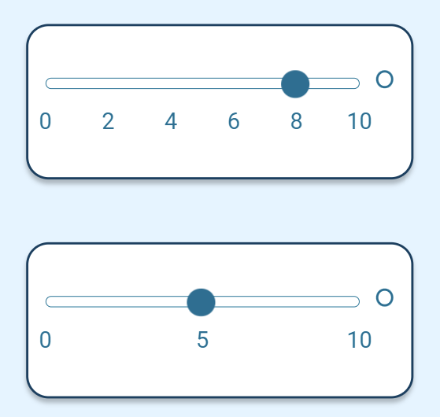

# Slider

A slider allows users to adjust and set a value along a visual scale. It consists of a horizontal bar with a movable handle that users can drag (or "slide") to select a specific value within a predefined range. Sliders are often used to enable users to fine-tune settings, make selections or adjust numerical values. 
## Example

| type      | name          |parameter_list                 |
| --------- | ------------  |---------                      |
|slider	    |slider_par_5_1 |min: 0; max: 10; step: 2       |
|slider     |slider_par_5_2 |min: 0; max: 10; step: 5       |

[Google Sheet Demo](https://docs.google.com/spreadsheets/d/1oSJHE2gq_WqgQM6NAKWBfuxCXIjcJ1k4aIUl422QK60/edit#gid=569531329)   
[Live Preview Demo](https://idems-debug.web.app/template/comp_slider)

## Parameters

| Parameter             | Value                                                        | Description                                                     |
| ---------             | -----------                                                  | ---------                                                       |                              
|help                   |string                                                        | Any text for help tooltip                                       |             
|title                  |string                                                        | Any text as a title                                             |
|min        |number                                                        | Any number as min value. Min should be less than max   |
|max       |number                                                        | Any number as max value. Min should be less than max   |
|min_value_label        |string                                                        | A string below the minimum value                                |
|max_value_label        |string                                                        | A string below the maximum value                                |
|step           |number                                                        | A number as a step size. This number needs to divide (max - min)|
|labels_count   |number   | A number as the number of labels to show. This labels count minus 1 needs to divide (max - min). It is possible to select values in between labels.|
|no_value               |false (default)                                               | To be removed                        |
|no_value               |true                                                          | To be removed                        |
|no_value_text          |'no_value' (default)                                          | To be removed                        |
|no_value_text          |string                                                        | To be removed                        |
