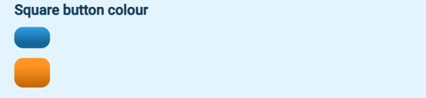

# Square button

## Example

| type         | name                  |parameter_list |
| ---------    | ------------             |--------- |
|square_button |square_button_par_3_1          |style: information|
|square_button |square_button_par_3_2         |style: navigation|

[Google Sheet Demo](https://docs.google.com/spreadsheets/d/1ptSCtSDQ-_PrgLuZiJouHa9k1nUEjg7eMzx9rVOKBUE/edit#gid=569531329)   
[Live Preview Demo](https://plh-teens-app1.web.app/template/comp_square_button)

## Parameters

| Parameter             | Value                 | Description |
| ---------             | -----------           | --------- |
|icon_src               |empty string (default) | Button without an icon|
|icon_src               | string  | Button with an icon. The `icon_src` can be a file path within the `global` subfolder of the assets folder or an icon in the [ionicons](https://ionic.io/ionicons) library |
|style                  |information (default)  | Primary background colour|
|style                  |navigation             | Secondary background colour with twice the width|
|disabled	            |false (default)        | To be removed|
|disabled	            |true                   | To be removed|

