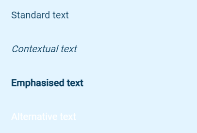

# Text
## Example

| type      | name            | value                       |parameter_list |
| --------- | ------------    | ------                      |--------- |
|text	      |text_formatting_1|Standard text                |style: standard|
|text       |text_formatting_2|Contextual text	            |style: contextual|

[Google Sheet Demo](https://docs.google.com/spreadsheets/d/1iZHeAAZAQ8q-XNKrW_ww3yvPUVGwc407uhAF7vu1TtM/edit#gid=569531329)   
[Live Preview Demo](https://plh-teens-app1.web.app/template/comp_text)

## Parameters

| Parameter             | Value               | Description                          |
| ---------             | -----------         | ---------                          	                                
|text_align             |left (default)       | Text is left aligned on the screen   |
|text_align             |centre               | Text is centre aligned on the screen |
|text_align             |right                | Text is right aligned on the screen  |
|style                  |standard (default)   | Text colour primary                  |
|style                  |contextual           | Italic font style                    |
|style                  |emphasised           | Bold font style                      |
|style                  |alternative          | Text colour white                    |
|style                  |small                | To be removed                        |
|style                  |medium               | To be removed                        |
|style                  |large                | To be removed                        |
|style                  |left                 | To be removed                        |
|style                  |centre               | To be removed                        |
|style                  |right                | To be removed                        |

