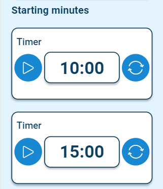

# Timer
## Example

| type      | name         |parameter_list             |
| --------- | ------------ |---------                  |
|timer	    |timer_par_5_1 |starting_minutes: 10       |
|timer      |timer_par_5_2 |starting_minutes: 15       |

[Google Sheet Demo](https://docs.google.com/spreadsheets/d/1jQAvELG5EXj6zgj0bBQmVg7Iaa-66OpemdZzgOh2PP0/edit#gid=569531329)   
[Live Preview Demo](https://plh-global.web.app/template/comp_timer)

## Parameters

| Parameter             | Value           | Description                 |
| ---------             | -----------     |  ---------                  |                            
|title                  |null (default)   | No title                    |
|title                  |string           | Any text as a title         |                  
|help                   |null (default)   | No help tooltip             |
|help                   |string           | Any text for help tooltip   |                  
|is_editable_on_playing |false (default)  | Not possible to change the values of the timer when it is running|
|is_editable_on_playing |true             | Possible to change the values of the timer when it is running| 
|duration_extension     |1 (default)      | Value for increasing the time on the timer|                        
|duration_extension     |number           | Any number as value for increasing the time on the timer|
|starting_minutes       |10 (default)     | 10 minutes by default   | 
|starting_minutes       |number           | Any number as starting minutes|
|starting_seconds       |0 (default)      | 0 seconds by default                    |
|starting_seconds       |number           | Any number as starting seconds          | 
