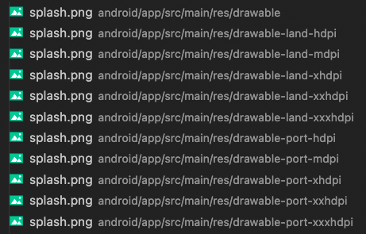
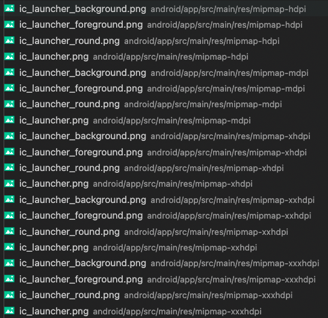

# Android Assets

Generating an Android launcher icon (aka "app icon") and splash screen image from source images. More information about each can be found in Google's official docs for [adaptive icons](https://developer.android.com/guide/practices/ui_guidelines/icon_design_adaptive) and [splash screens](https://developer.android.com/guide/topics/ui/splash-screen).

## Source image specification
Source images must be supplied in `.png` format. Splash screen generation requires a single source image (`splash.png` by convention). App icon generation requires a source image of the complete icon (`icon.png` by convention). Additionally, two images (`icon-background.png` and `icon-foreground.png` by convention) can be supplied that will be combined dynamically to generate various [adaptive icons](https://developer.android.com/guide/practices/ui_guidelines/icon_design_adaptive) of different shapes, so that the icon displays differently across different device models and settings. Older devices do not support adaptive icons, so the static icon image must be provided to be used as a fallback in these cases.

The splash image must be at least 2732×2732px. The static icon image must be at least 1024×1024px, while the foreground and background images must be at least 432×432px. If the source images are smaller than these sizes, the workflow will fail and the Android assets will not be generated.

## Example source files
| splash.png             | icon.png             | icon-background.png             |icon-foreground.png |
| ---------------------- | -------------------- | ------------------------------- |------------------- |
|||||


## Configuring splash screens and app icons
With `.png` files provided from which to generate the splash screen and app icons, their paths must be provided in the deployment `config` defined in the `.config.ts` file (see [Deployment Configuration](../deployments/) for a specification of this file). These paths are relative the root directory.

For example:

```ts title=".idems_app/deployments/plh/global.config.ts"
...

const config: IDeploymentConfig = {
  ...
  android: {
    splash_asset_path: "packages/app-data/assets/global/android/splash.png",
    icon_asset_path: "packages/app-data/assets/global/android/icon.png",
    icon_asset_foreground_path: "packages/app-data/assets/global/android/icon-foreground.png",
    icon_asset_background_path: "packages/app-data/assets/global/android/icon-background.png",
  },
  ...
};
...
```
## Generating Android assets through Github
With the assets correctly configured as above, the splash screen and launch icon will automatically be generated when the `Android - Release to Google Play` action is run.

## Generating Android assets locally
To generate the android assets locally, run
```sh
yarn workflow android
```
This will also populate the Android configuration files with the values of `app_id` and `app_name` as specified in the [deployment config](./deployments.md#android-app-management).

Alternatively, to generate just the splash screens or just the app icons, run
```sh
yarn workflow android set_splash_image
```
or
```sh
yarn workflow android set_launcher_icon
```
respectively.

## Example generated files
The following files should be generated, depending on the configuration:

| Splash screens  | App icons  |
| ---- | ---- |
|||

