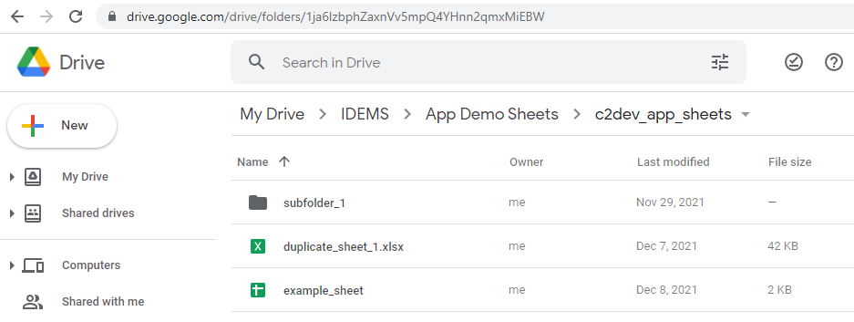

# Deployments

All user-generated content are stored within deployments, alongside app-specific settings such as remote data sources and app strings.


## Create Deployment
All deployments are stored in the `.idems_app/deployments` folder, and new deployments can be added by calling the script:

```sh
yarn workflow deployment create
```
This will prompt for a deployment type

| Option      | Details          | 
| --------- | ------------  | 
| New Local Deployment	    | A new standalone deployment, will have a clean configuration. This could be an entirely new app, or related to another deployment but managed independently      | 
| Extend Existing Local	    | Will inherit the configuration of another deployment for modification. This could be a country-specific or A/B testing version      | 

## Change Deployment
To set the active deployment for the workspace run the following script:
```sh
yarn workflow deployment set
```
This will present an interactive list of deployments to select from

Alternative a name can be provided to select directly
```sh
yarn workflow deployment set example
```

!!! Tip
    If the deployment name contains spaces use quotation marks when specifying, e.g. `yarn workflow deployment set "another example"`


## Customise Configuration
When a deployment is created a default configuration will be created in the `.idems_app/deployments` folder. E.g. for a deployment named *example*

```ts title=".idems_app/deployments/example/config.ts"
import { getDefaultAppConfig, IDeploymentConfig } from "data-models";

const app_config = getDefaultAppConfig()

// Override any app config here
app_config.APP_HEADER_DEFAULTS.title = 'Example Deployment'
app_config.APP_SIDEMENU_DEFAULTS.title = 'Example Deployment'

const config: IDeploymentConfig = {
  name: "example",
  google_drive: {
    sheets_folder_id: "",
    assets_folder_id: "",
  },
  app_config
};
export default config;
```
This configuration provides a minimal set of options to override the default header and sidemenu text, as well as configuring a remote google_drive data source (more information below)

A full list of app_config and their default values can be found in [packages/data-models/appConfig.ts](https://github.com/IDEMSInternational/parenting-app-ui/blob/master/packages/data-models/appConfig.ts)

A full list of general configuration options can be found in [packages/data-models/deployment.model.ts](https://github.com/IDEMSInternational/parenting-app-ui/blob/master/packages/data-models/deployment.model.ts)

Any configuration changes can be applied by setting the deployment
```
yarn workflow deployment set [name]
```

## Change Deployment
To set the active deployment for the workspace run the following script:
```sh
yarn workflow deployment set
```
This will present an interactive list of deployments to select from

Alternative a name can be provided to select directly
```sh
yarn workflow deployment set "My Deployment"
```

## Google Drive Management
The deployment configuration requires IDs for two created Google Drive folders, one for template sheets and one for global assets. 

The folders should again be named without spaces or special characters, and once created their unique IDs can be found by looking at the end of the URL bar when navigating inside the folder on Google Drive.

E.g. `1ja6lzbphZaxnVv5mpQ4YHnn2qmxMiEBW`




