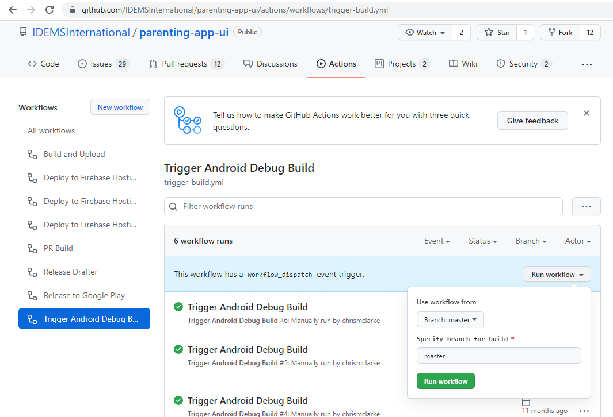
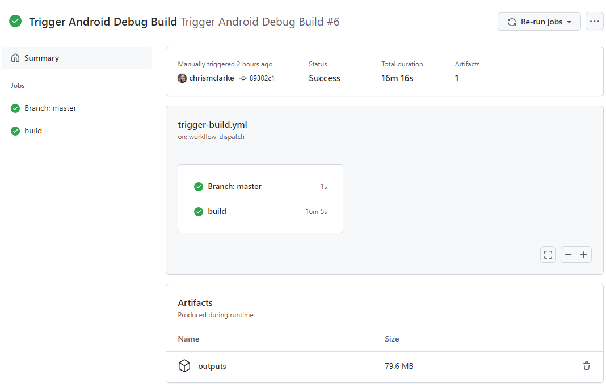

# On-device Testing

## Generate apk 
A custom github action exists that can be used to trigger the building of android APKs from a given repo branch. Visit the action url and click Run workflow to initiate a build
https://github.com/IDEMSInternational/parenting-app-ui/actions/workflows/trigger-build.yml

 
Note – this method of apk generation is preferred to manually creating via Android studio as it populates additional config ignored from the the main repo (e.g. google-services json file)
 
## Download outputs file
Once build is complete click on the workflow to view the output. The outputs file can be found at the bottom of the page

## Install debug apk
The outputs file will contain a nested apk -> debug -> app-debug.apk file. This should be copied to a mobile device and installed.

*NOTE 1*  
If a version of the app downloaded from the play store exists on the device it will need to first be uninstalled

*NOTE 2*   
You may receive warning about downloading an app from unverified sources or one that is not registered with play-protect. This is expected, and you should follow any relevant guidance to allow the installation.
