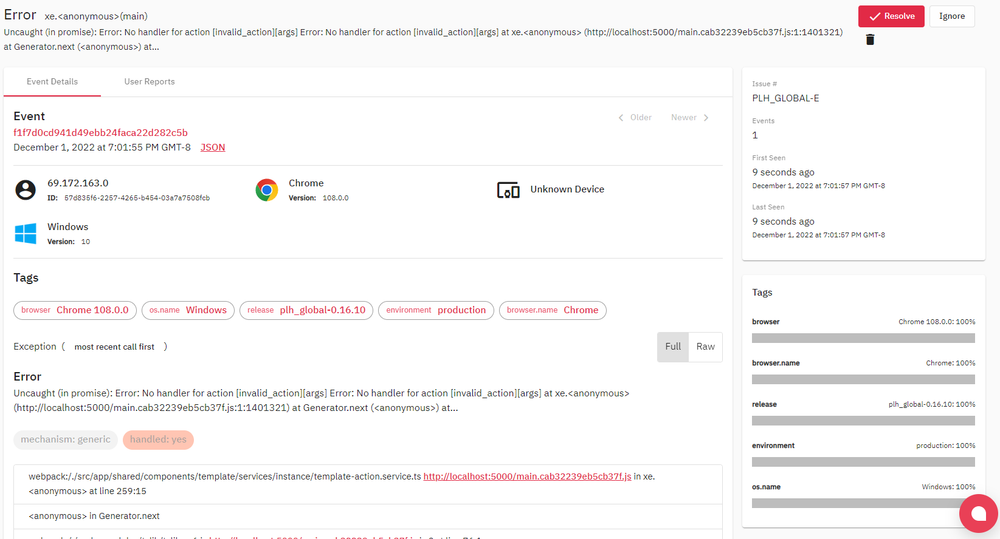
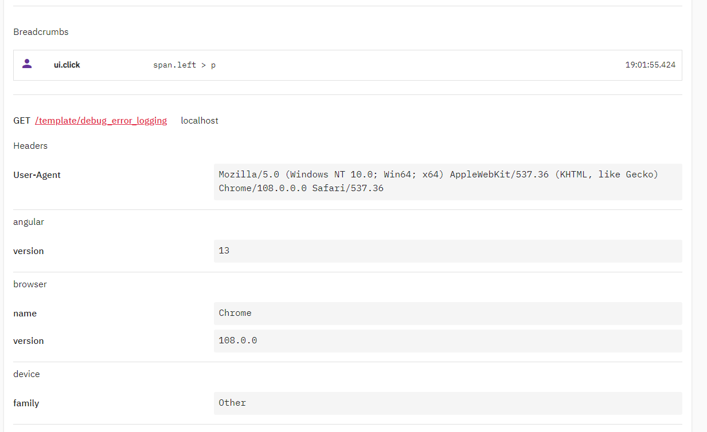

# Error Logs

## Providers
Logs are configured for multiple providers

### Crashlytics
Firebase crashlytics logs any native crashes as well as logged errors. The dashboard will be linked to the profile used in the firebaseConfig.ts file, for PLH access can be requested from the core team.

### Sentry
In addition runtime errors can be logged to sentry (or glitchtip) by specifying a dsn in a deployment config
```ts
 error_logging:{
    dsn:'https://abcde@domain.com/1234'
  },
```

## Debugging Logs
Logs viewed in glitchtip will include a lot of useful information that can be used for debugging

  

A full stack trace will be given at the bottom, which includes both path to minified code alongside mapping to source code (sourcemaps are populated during the build process but not available in the main build)

As you scroll down you can see the page viewed in the app as well as exact device/browser information
  

### Replicating errors
In most cases errors can likely be recreated by navigating to the same template page when browsing locally. There may however be some cases where an issue is specific to a particular browser (often older ones), or android device

In order to replicate older browsers, it is recommended to download a portable version of chromium (zip) from [https://chromium.cypress.io](https://chromium.cypress.io)


If even older versions are required (not recommended) you can follow instructions from the [chromium website](https://www.chromium.org/getting-involved/download-chromium/#downloading-old-builds-of-chrome-chromium)
