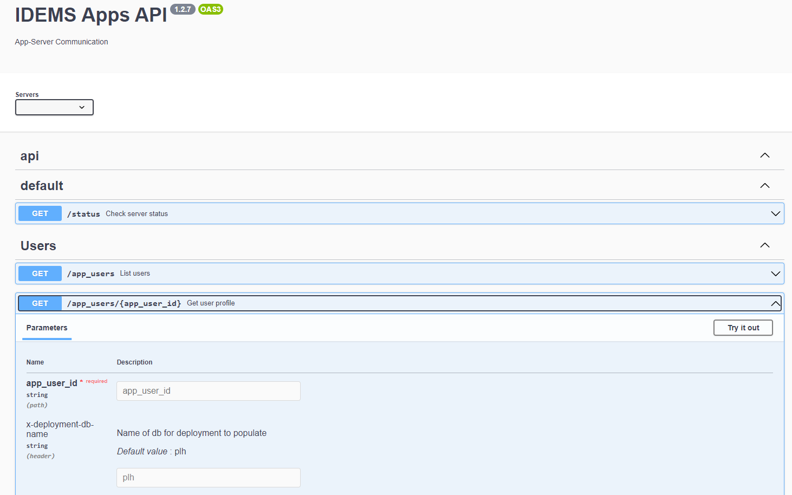

# Server Development

The apps server consists of 2 major components

**API**  
A [NestJS](https://docs.nestjs.com) rest api to handle communication between the app and backend database

**Stack**   
A set of docker containers to run all backend services, including postgresDB, matomo analytics, metabase and various other tools

## API development
Requires [postgres13](https://www.postgresql.org/download/) installed locally

1. Set environment variables
```bash
cp packages/api/.env.example packages/api/.env
```
Ensure `API_BASE_PATH=""` to allow running standalone (as opposed to part of full stack)

2. Ensure the named `POSTGRES_USER` specified in `.env` also exists on postgres database with admin privileges. More info on creating users using PGAdmin4 can be found in this [Google Doc](https://docs.google.com/document/d/1YLxLQfr0UC0VdA-fVOVeKSnHaVySi2gQ7FCLQQozqv8/edit?usp=sharing)

3. Serve api
  ```bash
  yarn workspace api start:watch
  ```

    This will start a local api server alongside interactive documentation for testing endpoints
    This can be found on [localhost:3000](http://localhost:3000)

    !!! note
        If postgres is not configured to start at boot time, as seems to be the case by default on macOS, then you must manually start it before serving the API. In order to start postgres running in the background, run `pg_ctl -D /usr/local/var/postgres start`.

    *Example Docs - endpoints can be viewed and triggered with parameters*

    

4. Interact with app.
By default any app running locally via `yarn start` will target the localhost api, so in-app operations such as contact field syncing can be tested in the same way as production

### API Tests
E2E tests can be run via
```sh
yarn workspace api test:e2e
```
If developing tests an option `--watch` flag can be added at the end to live-reload

An additional admin user will need to be created on the local db as an alternative to the postgres admin. This will also require creation of a database to support initial bootstrap connection

```
username: test_admin
password: test_admin

database: test_admin
```


## Stack development
Requires [docker desktop](https://www.docker.com/products/docker-desktop/) installed locally

1. Configure .env variables as per `packages\server\README.md`
Ensure `API_BASE_PATH="/api/"` to allow running as part of full stack
   
2. Build api
```bash
yarn workspace api docker:build
```

3. run server stack
```bash
yarn workspace server start
```
NOTE - if users need to be configured then this can be done using the stack PGAdmin available at `localhost:5050` with a connection host name `db` (instead of localhost)


1. Interact with app
Update the `API_ENDPOINT` specified in `src\app\shared\services\server\interceptors.ts` to target docker stack in development, i.e. `http://localhost/api`.

Run the app via `yarn start`