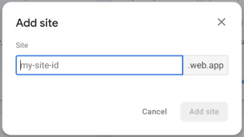

# Web Previews
Web previews can be configured for a deployment using the [reusable-deploy-web-preview](../../../.github\workflows\reusable-deploy-web-preview.yml) github action.

The action requires a Firebase project to be setup, and environment variables set to specify the `FIREBASE_PROJECT_ID` and `FIREBASE_DEPLOYMENT_TARGET`

This action should be called from a child content repo and configured as required. E.g.

_.github/workflows/deploy-firebase.yml_
```yml
name: Deploy - Firebase

on:
  push:
    branches:
      - "main"

jobs:
  web_preview:
    uses: IDEMSInternational/parenting-app-ui/.github/workflows/reusable-deploy-web-preview.yml@master
    secrets: inherit
```


---
# Legacy Docs
A preview for a given app deployment, running in browser, can be generated via GitHub. The URL for this preview can then be shared. In general, these previews are accessible at `<deployment_name>.web.app`, e.g. [wash.web.app](https://wash.web.app/). When viewing a web preview, it is recommended to [enable device mode] in Chrome DevTools in order to simulate the mobile experience.

## Updating an existing web preview
By convention, a given deployment should have two branches in the repo associated with it: `deployment/<deployment_name>` and `deployment_dev/<deployment_name>`. GitHub actions are configured so that any changes pushed to the `deployment/` branch (e.g. on the merging of a pull request from `deployment_dev/<deployment_name>` into `deployment/<deployment_name>`), triggers the web preview associated with that deployment to be updated to reflect the state of the `deployment/` branch.

## Configuring a new web preview for a deployment
!!! note
    This process may be changed and improved in the future

Creating a new web preview for a deployment must be done by a user with the relevant Firebase permissions. Assuming that the desired [deployment](../deployments/#customise-configuration) already exists, along with its respective `deployment/` and `deployment_dev/` branches, the following steps should be followed in order to associate it with a web preview URL on Firebase hosting:

1. In the Firebase console, navigate to Hosting and select "Add another site". For the site id, it is recommended to use the deployment name for simplicity.
  
2. After adding the site to Firebase, two files within the repo must be edited in order to configure the deployment to use Firebase hosting. In `firebase.json`, append the `hosting` array to include the following entry, substituting the "example_deployment" target for the name of your deployment.
``` json
{
  "hosting": [
    ...
    {
      "target": "example_deployment",
      "public": "www",
      "ignore": ["firebase.json", "**/.*", "**/node_modules/**"],
      "rewrites": [
        {
          "source": "**",
          "destination": "/index.html"
        }
      ]
    },
    ...
  ]
}
```
1. In the file `.firebaserc`, append the "hosting" object to include the following, substituting "example_deployment" for the name of your deployment in both instances.
``` json
{
  "projects": {
    "default": "plh-teens-app1"
  },
  "targets": {
    "plh-teens-app1": {
      "hosting": {
        ...
        "example_deployment": [
          "example_deployment"
        ],
        ...
      }
    }
  }
}
```
If your firebase site does not match your deployment name, then instead use the format `"example_deployment": ["example_firebase_site_id"]`

The web preview is now configured. You can make the first release by pushing to the `deployment/` branch for your deployment. It may take a few minutes for the site to update and display the content when making the first release.