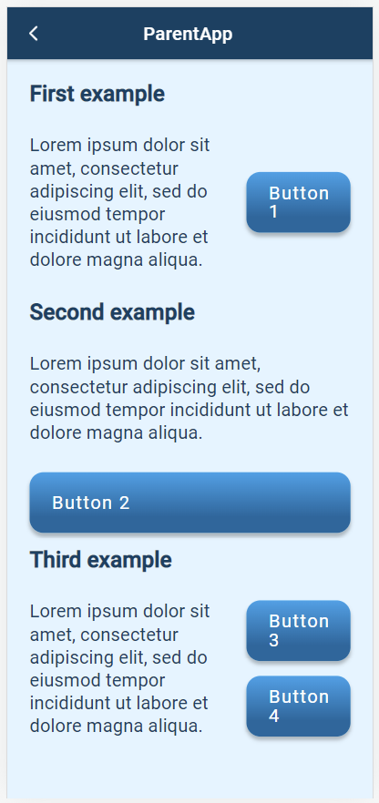

# Positioning components

**Is it possible to do word wrapping around images, or must images be all by themselves on a row?**

_Asked on 14 February 2022_

We don't exactly have a syntax to get text to wrap around an image. The system we use to get something similar (at least to get components to display side-by-side) is based on "display groups". To show you how these work I authored the template `example_dg`([sheet](https://docs.google.com/spreadsheets/d/1i6Th92RAkGfardxSJdJYWVoMtTkaNr-Xn2kIHDvtQoQ/edit#gid=1595229908) / [web preview](https://plh-global.web.app/template/example_dg)), which corresponds to the screenshot below. 

_Answered on 14 February 2022 by ETW_