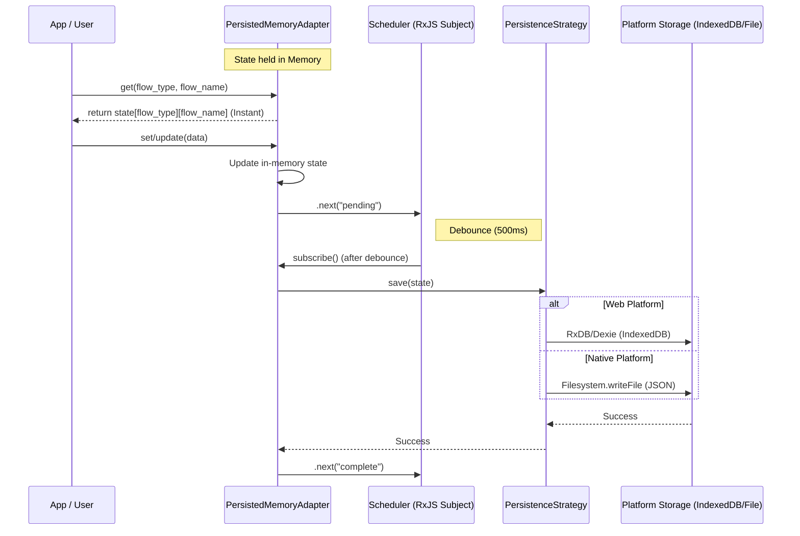

# Dynamic Data Persistence

This module manages the persistence of dynamic user data in the Open App Builder. It effectively acts as a key-value store where the state is held in memory and persisted to disk/storage asynchronously.

## Architecture

The persistence layer uses a **Strategy Pattern** to support different storage mechanisms based on the running platform.

## Strategies

### 1. Web: `RxDBPersistenceStrategy`
- **Backing Store:** IndexedDB (via RxDB/Dexie).
- **Use Case:** Web browsers.
- **Features:**
    - Uses existing RxDB configuration with schema and migrations.
    - Requests `navigator.storage.persist()` to minimize eviction risk.

### 2. Native (iOS/Android): `FilePersistenceStrategy`
- **Backing Store:** Filesystem (JSON file in `Directory.Data`).
- **Filename:** `oab-dynamic-data.json`.
- **Use Case:** Native iOS and Android apps.
- **Rationale:** Native OSs often clear IndexedDB/WebStorage data when device memory is low. Files stored in the application's Data directory are persistent and safe from OS cleaning.
- **Performance:** Reads/writes the entire state as a single JSON blob. Efficient for the expected data size (<50MB) and access patterns (batch read on load, debounced batch write).

## Migration

A one-time migration is implemented to transitions existing native users from RxDB to File storage.

**Logic:**
1. On app launch (Native only), check if `oab-dynamic-data.json` exists.
2. **If Exists:** specific strategy is `FilePersistenceStrategy`. Load data from file.
3. **If Missing:**
    - Check if data exists in RxDB (legacy persistence).
    - **If RxDB has data:**
        - Load data from RxDB.
        - Save data to `FilePersistenceStrategy` (`oab-dynamic-data.json`).
        - Switch to File strategy.
    - **If no RxDB data:** Initialize empty `FilePersistenceStrategy`.
