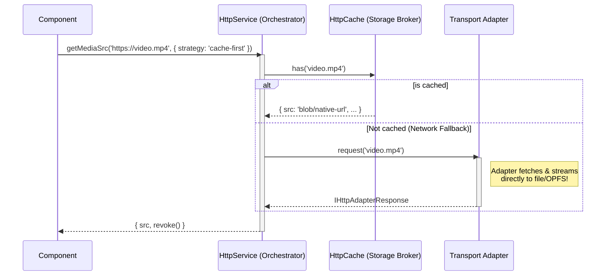

# Smart HTTP Service (`HttpService`)

The `HttpService` is a comprehensive, offline-first network orchestrator for the application domain.

At its core, it applies the **Strategy** and **Adapter** patterns to execute network requests, caching them efficiently using platform-specific storage mechanisms. It automatically distinguishes between data and large media streams, deciding the most memory-efficient way to transport data.

## Features
- **Cross Platform Transports**: Automatically selects the best underlying HTTP client (Browser Fetch, Web Workers, or Native Capacitor transfers).
- **Smart Mimetype Routing**: Media requests (Audio, Video, PDF) are intelligently offloaded to OPFS workers or Native file transfer plugins to protect the Javascript UI thread.
- **Offline Strategies**: Supports `cache-first`, `network-only`, `network-first`, and `cache-only` fetch mechanisms.
- **Base64 Bypass**: Massively optimizes Capacitor bridge memory by downloading media directly to the Native filesystem, returning secure `localhost` native mapped URLs (`convertFileSrc`) instead of sluggish Base64 payloads.

---

## Core Architecture

The architecture decouples the concept of a Request Strategy (orchestration) from the Transport details (the HTTP adapters).



### The Adapters & `IHttpAdapterResponse`

All client Adapters (Web, Capacitor, Worker) guarantee the same uniform data-retrieval interface (`IHttpAdapterResponse`):

1. **`getUri()`**: Returns a safe, bindable URL.
   - *Web/Worker*: Returns a short-lived `blob:http://` URL with a `revoke()` garbage collection function.
   - *Native*: Returns a secure device file path using `Capacitor.convertFileSrc()`.
2. **`getRawData()`**: Returns raw `ArrayBuffer` contents.
   - *Native*: Bypasses the expensive bridge by using the native browser `fetch()` API against the secure local file URL!

---

## Usage Examples

### 1. Simple Data Requests (JSON, Text)
Use `.get()` when you only need standard API responses. This returns a standard DOM `Response` object.

```typescript
const response = await this.httpService.get('https://api.example.com/data.json', {
  strategy: 'cache-first', 
  cacheExpiry: '7d' 
});
const data = await response.json();
```

### 2. Media SRC Requests (Images, Audio, Video)
Always use `.getMediaSrc()` when binding files to the UI.

```typescript
const media = await this.httpService.getMediaSrc('https://example.com/huge-video.mp4', {
  strategy: 'cache-first',
  cacheName: 'videos' // Store in a dedicated namespace for easy bulk cleanup!
});

// Bind to <video [src]="videoUrl">
this.videoUrl = media.src;

// Clean up memory if destroying component on Web (no-op on native)
media.revoke();
```