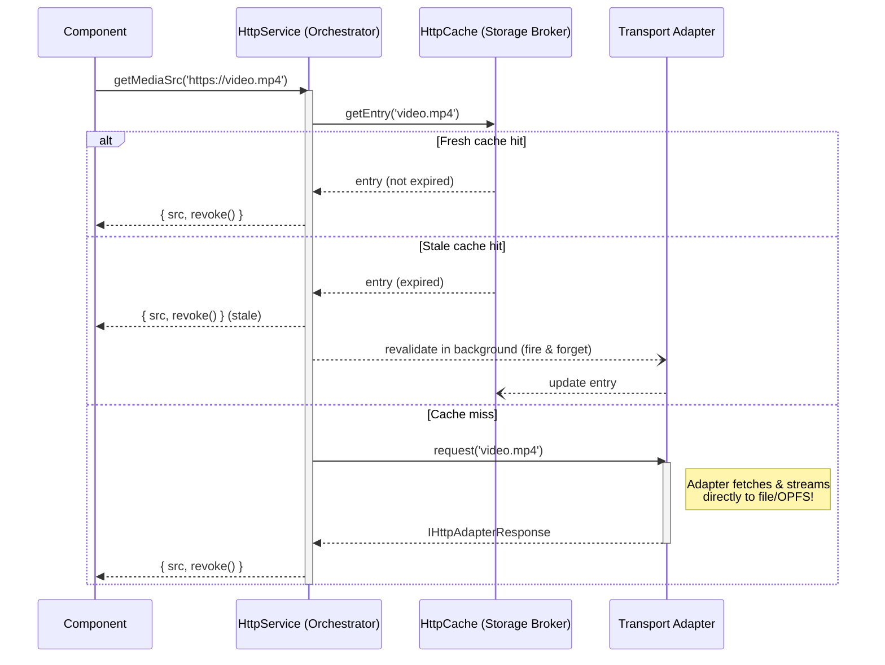

# Smart HTTP Service (`HttpService`)

The `HttpService` is a comprehensive, offline-first network orchestrator for the application domain.

At its core, it applies the **Adapter** pattern to execute network requests, caching them efficiently using platform-specific storage mechanisms with a unified **stale-while-revalidate** approach. It automatically distinguishes between data and large media streams, deciding the most memory-efficient way to transport data.

## Features

- **Cross Platform Transports**: Automatically selects the best underlying HTTP client (Browser Fetch, Web Workers, or Native Capacitor transfers).
- **Smart Mimetype Routing**: Media requests (Audio, Video, PDF) are intelligently offloaded to OPFS workers or Native file transfer plugins to protect the Javascript UI thread.
- **Stale-While-Revalidate Caching**: Cached responses are always served immediately. Stale entries trigger a silent background revalidation, ensuring the UI is never blocked and offline access is never broken.
- **Granular Cache Control**: Dedicated `invalidate()` and `clearNamespace()` methods allow precise, on-demand cache busting without interfering with offline availability.
- **Base64 Bypass**: Massively optimizes Capacitor bridge memory by downloading media directly to the Native filesystem, returning secure `localhost` native mapped URLs (`convertFileSrc`) instead of sluggish Base64 payloads.

---

## Core Architecture

The architecture decouples request orchestration from the transport details (the HTTP adapters). A single, unified caching flow handles all requests.

### Caching Flow

1. **Fresh cache hit** → Return immediately. No network request.
2. **Stale cache hit** → Return stale data immediately. Revalidate silently in the background for the next request.
3. **Cache miss** → Fetch from network, cache the response, and return.



### The Adapters & `IHttpAdapterResponse`

All client Adapters (Web, Capacitor, Worker) guarantee the same uniform data-retrieval interface (`IHttpAdapterResponse`):

1. **`getUri()`**: Returns a safe, bindable URL.
   - _Web/Worker_: Returns a short-lived `blob:http://` URL with a `revoke()` garbage collection function.
   - _Native_: Returns a secure device file path using `Capacitor.convertFileSrc()`.
2. **`getRawData()`**: Returns raw `ArrayBuffer` contents.
   - _Native_: Bypasses the expensive bridge by using the native browser `fetch()` API against the secure local file URL.

---

## Usage Examples

### 1. Simple Data Requests (JSON, Text)

Use `.get()` when you only need standard API responses. This returns a standard DOM `Response` object.

```typescript
const response = await this.httpService.get(
  "https://api.example.com/data.json",
  { cacheExpiry: "7d" }
);
const data = await response.json();
```

### 2. Media SRC Requests (Images, Audio, Video)

Always use `.getMediaSrc()` when binding files to the UI.

```typescript
const media = await this.httpService.getMediaSrc(
  "https://example.com/huge-video.mp4",
  {
    cacheName: "videos", // Store in a dedicated namespace for easy bulk cleanup
  }
);

// Bind to <video [src]="videoUrl">
this.videoUrl = media.src;

// Clean up memory if destroying component on Web (no-op on native)
media.revoke();
```

### 3. Bypassing Cache

For requests that should never be cached (e.g., auth tokens, session checks):

```typescript
const response = await this.httpService.get(
  "https://api.example.com/auth/session",
  { bypassCache: true }
);
```

### 4. Cache Invalidation

Invalidate a single resource or clear an entire namespace:

```typescript
// Remove a single cached URL
await this.httpService.invalidate(
  "https://example.com/outdated-image.png",
  "images"
);

// Wipe all cached videos
await this.httpService.clearNamespace("videos");
```

---

## When NOT to use HttpService

The `HttpService` is optimized for **Offline-First** scenarios and **Large Media** persistence. Because it uses the Native Filesystem or OPFS for efficient retrieval, it always leaves a persistent file behind.

For purely **transient, online-only resources** that do not require offline persistence (e.g., dynamic session icons, highly volatile tracking pixels, or preview-quality thumbnails):

1. **Bypass HttpService**: Bind absolute HTTPS URLs directly to standard HTML tags (e.g., ``).
2. **Leverage Browser Cache**: Standard WebViews and Browsers already have highly optimized ephemeral caching and garbage collection mechanisms for these types of resources, which is more efficient than persistent manual storage.