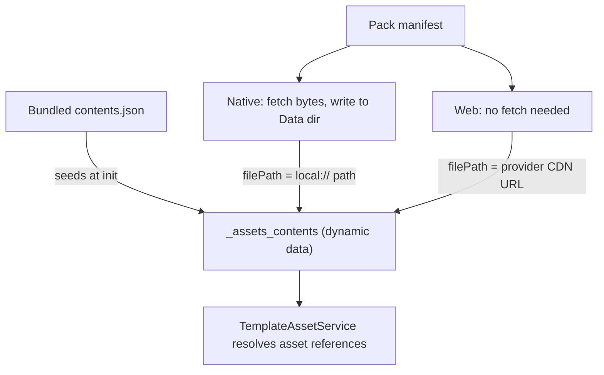

# Remote Assets

Remote assets let a deployment ship large media (images, audio, video) **outside** the app bundle and fetch it on demand, instead of bloating every install with files most users may never see. Content is grouped into named **asset packs** hosted in cloud storage; the app downloads a pack when a template asks for it, and from then on the asset resolves exactly like a bundled one.

The feature is a no-op unless the deployment opts in:

```ts
// deployment config
remote_assets: {
  provider: "supabase" | "firebase",
  bucketName: "my-bucket",  // supabase only; firebase uses firebase.config.storageBucket
  folderName: "assets",     // path prefix inside the bucket
}
```

Without `remote_assets.provider` the service sets `remoteAssetsEnabled = false`, registers the template actions so authors get an explanatory error rather than a silent no-op, and does nothing else.

## Files in this folder

| File | Responsibility |
| --- | --- |
| `remote-asset.service.ts` | Everything stateful: init, download orchestration, per-file fetch/save/integrate, resume |
| `remote-asset-metadata.service.ts` | Reads/writes pack status rows in the `_asset_packs` data list |
| `remote-asset.actions.ts` | The `asset_pack: *` template actions and their param parsing |
| `remote-asset.types.ts` | Shared types and the two protected data list names |
| `providers/` | `IRemoteAssetProvider` plus Supabase and Firebase implementations |

## The central idea: `_assets_contents`

Everything hangs off one dynamic data list, `_assets_contents`. `TemplateAssetService` reads it to turn an authored asset reference into a real path, and it does not care where a row came from.

At startup the list is seeded from the **bundled** (core) asset contents. Downloading a pack simply **overwrites rows in that same list** with paths that point at the newly available copies. That is why an author can write `my_image.png` without knowing whether it ships in the bundle or arrives from a pack — resolution is identical either way.



Note the platform split: **native downloads files, web does not.** On web the browser can stream straight from the provider's CDN, so a "download" only rewrites `filePath` to a public URL. All the filesystem, resume and integrity logic below is native-only.

### `filePath` is never an absolute device path

On native, a downloaded row stores `local://<pack-relative path>` — never the absolute path the file currently sits at. iOS relocates the app container whenever the app is updated ([Apple TN2285](https://developer.apple.com/library/archive/technotes/tn2285/_index.html): *"the absolute path to the app's container [...] will change [...] you must only save paths to files relative to your application container"*), so an absolute path stored at download time goes stale on the next release and every downloaded asset silently stops rendering — while `_asset_packs` still reports the pack as `completed`, so nothing re-downloads to repair it.

`TemplateAssetService` therefore resolves `local://` paths **at the point of display**, against the container reported for the current session (`FileManagerService.getLocalAssetPathConfig`, handed over during `RemoteAssetService` init). Rows written by app versions that stored absolute paths are still understood: `getLocalAssetTargetPath` recovers the pack-relative tail, so they re-point to the live container on next launch without needing a migration.

## Slots

A manifest row is one logical asset, but it can carry several files: the base file plus one override per theme/language combination. Each downloadable file is called a **slot** — one base slot (unless the entry is `overridesOnly`) plus one per override.

Slots matter because they are the unit of nearly everything: progress counts, download success/failure, and resume decisions are all per-slot, even though `_assets_contents` stores them together in a single row keyed by the base asset id (overrides nested under `overrides[theme][language]`).

## Download lifecycle

A pack's state lives in the `_asset_packs` data list, one row per pack, with a `download_status` of:

| Status | Meaning |
| --- | --- |
| `in_progress` | Actively downloading |
| `waiting_for_connection` | Offline; parked and will continue automatically when connectivity returns |
| `completed` | Every slot downloaded and integrated |
| `error` | Something failed; needs an explicit re-trigger |
| `cancelled` | The user/template cancelled it |

Execution is deliberately serial: **one pack at a time, one file at a time** within it. Requesting a second, different pack while one is active is refused (see *Concurrency* below). There is no download queue yet — a `TODO` in `downloadAndIntegrateAssetPack` tracks this.

A pack only reaches `completed` when **all** slots succeed. Per-slot failures are counted and returned as `failedCount`; a non-zero count throws, which either parks the pack (offline) or surfaces it as `error` (online). This matters: silently marking a pack complete with missing files leaves the app permanently referencing assets that will never arrive.

## Resume after interruption

Downloads run in the WebView's JS runtime, so killing or backgrounding the app kills the download. Recovery is *restart and skip what's already done*, not byte-range continuation.

**On launch**, any pack still sitting at `in_progress` or `waiting_for_connection` is picked up automatically — process death skips cleanup, so a stale status *is* the interruption signal. `error` and `cancelled` packs never auto-resume: the first waits for an explicit re-trigger (either `asset_pack` action will do, since `ensure_downloaded` only skips packs already `completed`), the second reflects user intent.

**Per slot**, the download is skipped only on *positive evidence* that a previous run finished this exact file. All three must hold:

1. The file exists on disk (`FileManagerService.getSavedFileInfo`), and
2. its size matches the manifest's `size_kb`, and
3. the `_assets_contents` entry recorded for that slot carries the manifest's checksum **and** has a `filePath` that is a local asset path.

Point 3 does the real work. Integrating a base asset writes the whole manifest entry, so the row also picks up every *override's* checksum before those files exist — a checksum alone would vouch for slots that were never downloaded, and only a rewritten `filePath` proves this app saved one. Manifest override entries carry a pack-relative path, which is never itself a local asset path, so the two stay distinguishable. Absolute paths from older app versions count as evidence too, so taking an update resumes rather than re-downloading every pack.

Anything unverified re-downloads. The cost of a false negative is one wasted file fetch; the cost of a false positive is a corrupt asset that never heals, so the gate is deliberately biased toward re-downloading.

**Not covered:** the on-disk bytes are never hashed. Web Crypto has no MD5, and hashing would only catch external corruption of an already-integrated file — out of scope for interrupt-resume, and better handled by a future `asset_pack: verify`/repair action that owns the MD5 dependency.

### Concurrency

Two different requests for the **same** pack join the same in-flight attempt rather than the second one failing — launch-time resume can easily race a template-triggered download for the same pack.

A request for a **different** pack while one is active is refused, but the two entry points differ in what happens next:

- **Background** (`awaitCompletion: false`, used by resume): the refused packs are retried once the active download settles, so the queue is not dropped.
- **Awaited** (`awaitCompletion: true`, the default for `ensure_downloaded`): returns `false` immediately. This is intentional — an awaited call blocks the template action queue, and a pack parked in `waiting_for_connection` can wait indefinitely, so it must not be able to wedge the queue behind unrelated work.

## Template API

```yaml
asset_pack: download | ensure_downloaded | cancel_download | reset
```

| Action | Behaviour |
| --- | --- |
| `download` | Download a single named pack. Always runs, even if the pack is already `completed`, and always blocks the action queue until it finishes |
| `ensure_downloaded` | Download only packs not already `completed`. Takes `asset_pack` or `asset_pack_list` (array or JSON string), plus `await` (default `true`) to block the action queue or not |
| `cancel_download` | Abort all active downloads and mark them `cancelled`. Dispatched immediately rather than queued (see *Cancelling* below) |
| `reset` | Clear downloaded contents and pack metadata, back to the pre-download state (testing aid; does not yet delete files from the device) |

### Debug options

#### Cancelling

A download holds the template action queue for its full duration, so a queued `cancel_download` would only run once the download it aborts had finished. It bypasses the queue instead, via `TemplateActionRegistry.registerImmediate`. Author it as the only action on its trigger, and not behind `trigger_actions`, or it is queued like anything else.

A cancel therefore lands mid-attempt, so `_asset_packs` status writes are serialised in `RemoteAssetMetadataService`, carry the attempt's abort signal, and treat `cancelled` as sticky until a later attempt starts. Serialising is the load-bearing part: `dynamicDataService.upsert` awaits internally before writing, so an `in_progress` upsert issued *before* the cancel could otherwise be applied *after* it — and a pack left `in_progress` is what resume treats as "restart me". Only `download_status` needs this; a stray count or file write after a cancel is harmless.

Cancelling aborts the loop, not the socket: the file request already in flight runs to completion and its result is discarded at the next checkpoint.

#### Artificial delay

Both `download` and `ensure_downloaded` accept `debug_download_delay_ms`, a manual testing aid that pauses for that many ms before each asset file:

```yaml
asset_pack | download: my_asset_pack | debug_download_delay_ms: 3000
```

This exists to open a reliable window for interrupting a download — force-quitting the app mid-pack, toggling airplane mode — which is otherwise hard to hit on a fast connection. It defaults to `0`, is scoped to the single action call that sets it, and an unparseable value is ignored rather than breaking the download. Note the delay applies to *skipped* files too, so with it on a resume won't look faster: verify resume by status and counts reaching completion, not by speed.

Progress and status are exposed to authoring in two places:

- **`asset_pack_download_in_progress`** — a system variable holding a boolean string, for showing or hiding UI while any download is running. Referenced as `@fields._asset_pack_download_in_progress`, or as `@system.asset_pack_download_in_progress` in deployments using `useReactiveTemplates`.
- **The `_asset_packs` data list** — one row per pack, carrying the full `download_status` plus fine-grained counts (`assets_downloaded_count` of `assets_total_count`, in slots) and the start/completion timestamps. This can be consumed, for example, to drive a progress bar, i.e. via `data_items`.

## Where packs come from

Asset packs are produced at sync time: assets destined for a pack are held out of the bundled app assets and written to `app_data/remote_assets/{packName}/` instead. Two config paths produce one:

- An entry in `google_drive.assets_folders` marked `remote: true` — the folder's `name` becomes the pack name.
- A Canto source folder with `remote_assets` entries — each declares a pack `name` plus a `condition` selecting which of that folder's files belong to it. Files matching no condition stay as core assets.

Each pack folder gets a `{packName}.json` manifest in `asset_pack` flow format, carrying every entry's `size_kb` and `md5Checksum` — the same metadata the resume gate later relies on. A `contents.json` is written alongside it in the standard core-asset format; only the manifest is fetched at runtime, so the extra file is not currently used but is harmless to include in upload. Pack folders are then uploaded to the configured bucket (currently a manual process), where the app expects:

```
{folderName}/{packName}/{packName}.json   <- manifest
{folderName}/{packName}/{relativePath}    <- each asset file
```

## Known limitations

- **No background continuation.** Downloads stop when the app is backgrounded or killed and resume on next launch. Continuing while backgrounded needs a native downloader plugin and is not implemented.
- **No download queue.** One pack and one file at a time; large packs are slow and cannot be parallelised.
- **`reset` leaves files on disk.** It clears metadata and contents rows but does not reclaim storage.
- **No integrity repair.** There is no way to detect or fix an already-integrated file that was corrupted after the fact.
