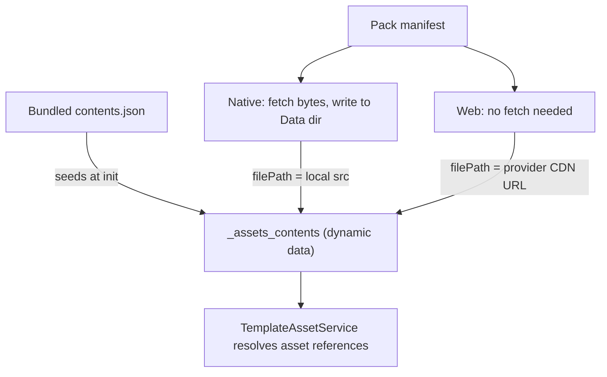

# Remote Assets

Remote assets let a deployment ship large media (images, audio, video) **outside** the app bundle and fetch it on demand, instead of bloating every install with files most users may never see. Content is grouped into named **asset packs** hosted in cloud storage; the app downloads a pack when a template asks for it, and from then on the asset resolves exactly like a bundled one.

The feature is a no-op unless the deployment opts in:

```ts
// deployment config
remote_assets: {
  provider: "supabase" | "firebase",
  bucketName: "my-bucket",  // supabase only; firebase uses firebase.config.storageBucket
  folderName: "assets",     // path prefix inside the bucket
}
```

Without `remote_assets.provider` the service sets `remoteAssetsEnabled = false`, registers the template actions so authors get an explanatory error rather than a silent no-op, and does nothing else.

## Files in this folder

| File | Responsibility |
| --- | --- |
| `remote-asset.service.ts` | Everything stateful: init, download orchestration, per-file fetch/save/integrate, resume |
| `remote-asset-metadata.service.ts` | Reads/writes pack status rows in the `_asset_packs` data list |
| `remote-asset.actions.ts` | The `asset_pack: *` template actions and their param parsing |
| `remote-asset.types.ts` | Shared types, the two protected data list names, and the storage folder name |
| `providers/` | `IRemoteAssetProvider` plus Supabase and Firebase implementations |
| `migrations/` | One-time migrations owned by this feature, run on init via `MigrationService` |

## The central idea: `_assets_contents`

Everything hangs off one dynamic data list, `_assets_contents`. `TemplateAssetService` reads it to turn an authored asset reference into a real path, and it does not care where a row came from.

At startup the list is seeded from the **bundled** (core) asset contents. Downloading a pack simply **overwrites rows in that same list** with paths that point at the newly available copies. That is why an author can write `my_image.png` without knowing whether it ships in the bundle or arrives from a pack — resolution is identical either way.



Note the platform split: **native downloads files, web does not.** On web the browser can stream straight from the provider's CDN, so a "download" only rewrites `filePath` to a public URL. All the filesystem, resume and integrity logic below is native-only.

### Local storage layout

On native, a pack's files are saved under its own folder within the deployment's storage:

```
Data/{deploymentName}/remote_assets/{packName}/{manifest-relative path}
```

The pack name is deliberately kept out of the manifest-relative path (exactly as it is for the remote path), so authoring stays agnostic about which pack an asset came from. Namespacing by pack means two packs shipping the same relative path can't overwrite each other, and makes "delete everything this pack downloaded" a single recursive folder delete.

The deployment folder itself holds non-asset files too — the cached auth profile picture, for one — so deletion must always target the `remote_assets` subfolder, never the deployment folder.

Older builds saved pack files straight into the deployment folder, where they would be stranded — invisible to the resume gate and untouched by `delete`/`reset`, which only clear `remote_assets/`. A one-time migration (`migrations/2026-08-05-namespace-remote-assets.ts`) cleans them up.

It works from `_assets_contents`, deleting only files the app has a record of having saved itself, rather than clearing the deployment folder of everything it doesn't recognise. That folder is shared with other features, and a migration owned by remote assets has no business deciding what someone else's data is. The trade-off is that a file saved but never integrated has no record and so survives — at most one per interrupted download.

Having deleted the files it also clears their `_assets_contents` references and resets `_asset_packs`, so affected packs download again into the new layout. Without that a pack would sit at `completed` with nothing on disk. Every pack row goes, because the old layout stored no pack name in the path — a legacy file can't be attributed to the pack it came from.

The migration is deliberately best-effort and swallows its own errors: a throwing migration halts app startup behind a critical-error alert, which a cache tidy-up does not warrant.

## Slots

A manifest row is one logical asset, but it can carry several files: the base file plus one override per theme/language combination. Each downloadable file is called a **slot** — one base slot (unless the entry is `overridesOnly`) plus one per override.

Slots matter because they are the unit of nearly everything: progress counts, download success/failure, and resume decisions are all per-slot, even though `_assets_contents` stores them together in a single row keyed by the base asset id (overrides nested under `overrides[theme][language]`).

## Download lifecycle

A pack's state lives in the `_asset_packs` data list, one row per pack, with a `download_status` of:

| Status | Meaning |
| --- | --- |
| `in_progress` | Actively downloading |
| `waiting_for_connection` | Offline; parked and will continue automatically when connectivity returns |
| `completed` | Every slot downloaded and integrated |
| `error` | Something failed; needs an explicit re-trigger |
| `cancelled` | The user/template cancelled it |

Execution is deliberately serial: **one pack at a time, one file at a time** within it. Requesting a second, different pack while one is active is refused (see *Concurrency* below). There is no download queue yet — a `TODO` in `downloadAndIntegrateAssetPack` tracks this.

A pack only reaches `completed` when **all** slots succeed. Per-slot failures are counted and returned as `failedCount`; a non-zero count throws, which either parks the pack (offline) or surfaces it as `error` (online). This matters: silently marking a pack complete with missing files leaves the app permanently referencing assets that will never arrive.

## Resume after interruption

Downloads run in the WebView's JS runtime, so killing or backgrounding the app kills the download. Recovery is *restart and skip what's already done*, not byte-range continuation.

**On launch**, any pack still sitting at `in_progress` or `waiting_for_connection` is picked up automatically — process death skips cleanup, so a stale status *is* the interruption signal. `error` and `cancelled` packs never auto-resume: the first waits for an explicit re-trigger (either `asset_pack` action will do, since `ensure_downloaded` only skips packs already `completed`), the second reflects user intent.

**Per slot**, the download is skipped only on *positive evidence* that a previous run finished this exact file. All three must hold:

1. The file exists on disk (`FileManagerService.getSavedFileInfo`), and
2. its size matches the manifest's `size_kb`, and
3. the `_assets_contents` entry recorded for that slot carries the manifest's checksum **and** has a `filePath` that differs from the manifest's own value.

Point 3 does the real work. Integrating a base asset writes the whole manifest entry, so the row also picks up every *override's* checksum before those files exist — a checksum alone would vouch for slots that were never downloaded, and only a rewritten `filePath` proves this app saved one. It is compared against the manifest value rather than against the expected local path so that platform path quirks (e.g. iOS `/private/var` vs `/var`) can't silently disable resume.

Anything unverified re-downloads. The cost of a false negative is one wasted file fetch; the cost of a false positive is a corrupt asset that never heals, so the gate is deliberately biased toward re-downloading.

**Not covered:** the on-disk bytes are never hashed. Web Crypto has no MD5, and hashing would only catch external corruption of an already-integrated file — out of scope for interrupt-resume, and better handled by a future `asset_pack: verify`/repair action that owns the MD5 dependency.

### Concurrency

Two different requests for the **same** pack join the same in-flight attempt rather than the second one failing — launch-time resume can easily race a template-triggered download for the same pack.

A request for a **different** pack while one is active is refused, but the two entry points differ in what happens next:

- **Background** (`awaitCompletion: false`, used by resume): the refused packs are retried once the active download settles, so the queue is not dropped.
- **Awaited** (`awaitCompletion: true`, the default for `ensure_downloaded`): returns `false` immediately. This is intentional — an awaited call blocks the template action queue, and a pack parked in `waiting_for_connection` can wait indefinitely, so it must not be able to wedge the queue behind unrelated work.

## Deleting a pack

`asset_pack: delete` reclaims a pack's storage and returns it to the "never downloaded" state, so a later `ensure_downloaded` fetches it again from scratch. It does four things per pack: cancel any in-flight download (first, so nothing can re-create what is about to be removed), delete the pack's storage folder, clear the contents references, and drop the `_asset_packs` row.

Clearing the references is what stops the app pointing at files that no longer exist. `TemplateAssetService` resolves a slot as `filePath || assetName`, so:

- a **base** slot has its `filePath` removed, falling back to the asset's bundled path
- an **override** slot is removed outright, so lookup falls through to a lower-priority override or to the base asset

Rows themselves are left in place. With no recorded `filePath` they read as "not downloaded" — which is both the correct resolution behaviour and exactly what the resume gate needs in order to re-fetch the slot next time.

A slot is judged to belong to the pack by matching the path this app would itself have produced for it — the `remote_assets/{packName}/` storage folder on native, the provider's public URL prefix on web — rather than by looking for the pack name anywhere in the path. That distinction matters: a bundled asset sitting in a folder that happens to share a pack's name must not be cleared.

Deleting a pack that was never downloaded is a harmless no-op, so the action is safe to call speculatively.

## Template API

```yaml
asset_pack: download | ensure_downloaded | delete | cancel_download | reset
```

| Action | Behaviour |
| --- | --- |
| `download` | Download a single named pack. Always runs, even if the pack is already `completed`, and always blocks the action queue until it finishes |
| `ensure_downloaded` | Download only packs not already `completed`. Takes `asset_pack` or `asset_pack_list` (array or JSON string), plus `await` (default `true`) to block the action queue or not |
| `delete` | Delete one or more downloaded packs — removes their files from the device, drops their `_asset_packs` rows, and clears the `_assets_contents` references that pointed at the deleted files. Takes `asset_pack` or `asset_pack_list`, or a name as an arg (`asset_pack: delete: my_pack`) |
| `cancel_download` | Abort all active downloads and mark them `cancelled` |
| `reset` | Return **every** pack to its pre-download state: cancel active downloads, delete all downloaded files, and clear both data lists |

Both `download` and `ensure_downloaded` accept `debug_download_delay_ms`, a manual testing aid that pauses for that many ms before each asset file:

```yaml
asset_pack | download: my_asset_pack | debug_download_delay_ms: 3000
```

This exists to open a reliable window for interrupting a download — force-quitting the app mid-pack, toggling airplane mode — which is otherwise hard to hit on a fast connection. It defaults to `0`, is scoped to the single action call that sets it, and an unparseable value is ignored rather than breaking the download. Note the delay applies to *skipped* files too, so with it on a resume won't look faster: verify resume by status and counts reaching completion, not by speed.

Progress and status are exposed to authoring in two places:

- **`asset_pack_download_in_progress`** — a system variable holding a boolean string, for showing or hiding UI while any download is running. Referenced as `@fields._asset_pack_download_in_progress`, or as `@system.asset_pack_download_in_progress` in deployments using `useReactiveTemplates`.
- **The `_asset_packs` data list** — one row per pack, carrying the full `download_status` plus fine-grained counts (`assets_downloaded_count` of `assets_total_count`, in slots) and the start/completion timestamps. This can be consumed, for example, to drive a progress bar, i.e. via `data_items`.

## Where packs come from

Asset packs are produced at sync time: assets destined for a pack are held out of the bundled app assets and written to `app_data/remote_assets/{packName}/` instead. Two config paths produce one:

- An entry in `google_drive.assets_folders` marked `remote: true` — the folder's `name` becomes the pack name.
- A Canto source folder with `remote_assets` entries — each declares a pack `name` plus a `condition` selecting which of that folder's files belong to it. Files matching no condition stay as core assets.

Each pack folder gets a `{packName}.json` manifest in `asset_pack` flow format, carrying every entry's `size_kb` and `md5Checksum` — the same metadata the resume gate later relies on. A `contents.json` is written alongside it in the standard core-asset format; only the manifest is fetched at runtime, so the extra file is not currently used but is harmless to include in upload. Pack folders are then uploaded to the configured bucket (currently a manual process), where the app expects:

```
{folderName}/{packName}/{packName}.json   <- manifest
{folderName}/{packName}/{relativePath}    <- each asset file
```

## Known limitations

- **No background continuation.** Downloads stop when the app is backgrounded or killed and resume on next launch. Continuing while backgrounded needs a native downloader plugin and is not implemented.
- **No download queue.** One pack and one file at a time; large packs are slow and cannot be parallelised.
- **No integrity repair.** There is no way to detect or fix an already-integrated file that was corrupted after the fact.
- **Packs downloaded before per-pack namespacing re-download once.** The cleanup migration reclaims their storage, but the resume gate cannot match files at the old paths, so each affected pack is fetched again into its new folder.
