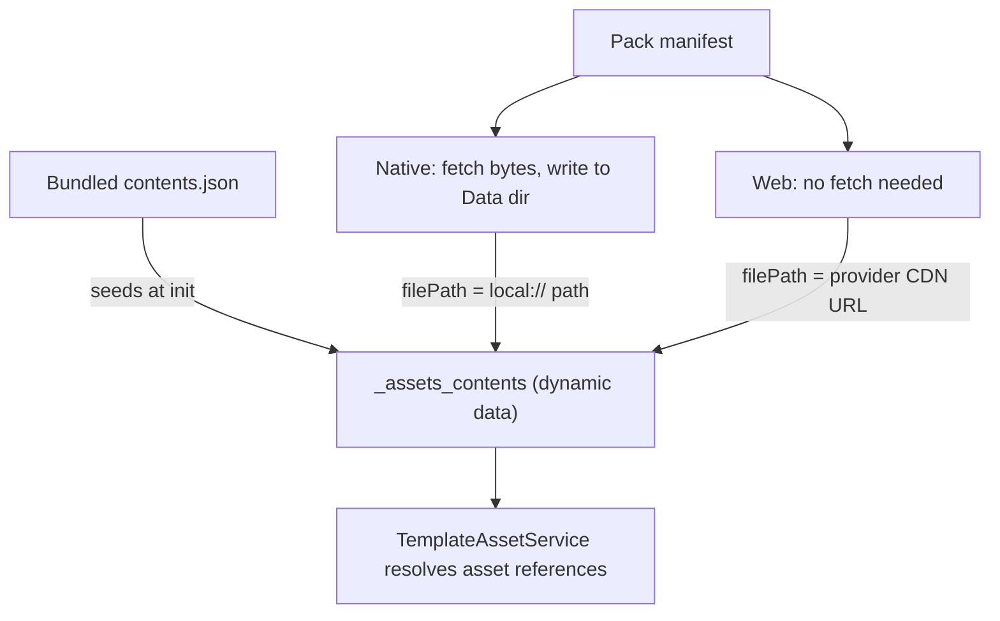

# Remote Assets

Remote assets let a deployment ship large media (images, audio, video) **outside** the app bundle and fetch it on demand, instead of bloating every install with files most users may never see. Content is grouped into named **asset packs** hosted in cloud storage; the app downloads a pack when a template asks for it, and from then on the asset resolves exactly like a bundled one.

The feature is a no-op unless the deployment opts in:

```ts
// deployment config
remote_assets: {
  provider: "supabase" | "firebase",
  bucketName: "my-bucket",  // supabase only; firebase uses firebase.config.storageBucket
  folderName: "assets",     // path prefix inside the bucket
}
```

Without `remote_assets.provider` the service sets `remoteAssetsEnabled = false`, registers the template actions so authors get an explanatory error rather than a silent no-op, and does nothing else.

> Most of the *why* behind the behaviour below lives in comments on the code that implements it. This README covers what the pieces are and how they fit; see [Where the reasoning lives](#where-the-reasoning-lives).

## Files in this folder

| File | Responsibility |
| --- | --- |
| `remote-asset.service.ts` | Everything stateful: init, download orchestration, per-file fetch/save/integrate, resume |
| `remote-asset-metadata.service.ts` | Reads/writes pack status rows in the `_asset_packs` data list |
| `remote-asset.actions.ts` | The `asset_pack: *` template actions and their param parsing |
| `remote-asset-archive.ts` | Streams a pack's `.zip` and hands back each wanted entry as it arrives |
| `remote-asset-contents.writer.ts` | Batches `_assets_contents` row updates and writes them in bulk |
| `remote-asset.types.ts` | Shared types, the two protected data list names, the storage folder name, and the retry/archive/version-check tuning constants |
| `providers/` | `IRemoteAssetProvider` plus Supabase and Firebase implementations |

## Mental model

### Everything hangs off `_assets_contents`

`TemplateAssetService` reads this one dynamic data list to turn an authored asset reference into a real path, and it does not care where a row came from. At startup the list is seeded from the **bundled** (core) asset contents; downloading a pack **overwrites rows in that same list** with paths pointing at the newly available copies. That is why an author writes `my_image.png` without knowing whether it ships in the bundle or arrives from a pack.



### Native downloads, web does not

On web the browser streams straight from the provider's CDN, so a "download" only rewrites `filePath` to a public URL. **All filesystem, resume, archive and integrity logic is native-only.**

### Slots

A manifest row is one logical asset but can carry several files: the base file plus one override per theme/language. Each downloadable file is a **slot** — one base slot (unless the entry is `overridesOnly`) plus one per override. Slots are the unit of progress counts, success/failure and resume decisions, even though `_assets_contents` stores them together in one row keyed by base asset id.

### Storage layout

```
Data/{deploymentName}/remote_assets/{manifest-relative path}
```

**Every pack shares that folder**, keyed only by manifest-relative path — the same key `_assets_contents` uses. An asset shipped by two packs is stored once, and the second pack's resume check finds it already downloaded. The trade-off is that a stored file carries no record of which pack fetched it, hence no per-pack delete (see [Known limitations](#known-limitations)). The deployment folder also holds non-asset files (the cached auth profile picture), so deletion must always target the `remote_assets` subfolder.

Rows store `local://remote_assets/<path>`, **never an absolute device path** — iOS relocates the app container on update ([Apple TN2285](https://developer.apple.com/library/archive/technotes/tn2285/_index.html)), so an absolute path goes stale on the next release and every downloaded asset silently stops rendering while `_asset_packs` still reports `completed`. `TemplateAssetService` resolves `local://` at display time against the container reported for the current session (`FileManagerService.getLocalAssetPathConfig`, handed to it during `RemoteAssetService` init). Absolute paths written by older app versions are still understood — `getLocalAssetTargetPath` recovers the deployment-relative tail — so no migration is needed.

## Template API

```yaml
asset_pack: download | ensure_downloaded | cancel_download | reset
```

| Action | Behaviour |
| --- | --- |
| `download` | Download a single named pack, named either as an action arg (`asset_pack: download: my_pack`) or an `asset_pack` param, arg winning if both are given. Always runs, even if already `completed`, and always blocks the action queue. Because it always re-walks the manifest, it is also how to force an update check |
| `ensure_downloaded` | Download only packs not already `completed`. Takes `asset_pack` or `asset_pack_list` (array or JSON string), plus `await` (default `true`) and `check_for_updates` (default `true`) |
| `cancel_download` | Abort all active downloads and mark them `cancelled`. Dispatched immediately rather than queued |
| `reset` | Return **every** pack to its pre-download state: cancel active downloads, delete all downloaded files, clear both data lists. All or nothing — if files cannot be deleted the data lists are left alone, so the app keeps describing what is actually on disk |

### Progress and status for authoring

- **`asset_pack_download_in_progress`** — system variable holding a boolean string, for showing/hiding UI while any download runs. Referenced as `@fields._asset_pack_download_in_progress`, or `@system.asset_pack_download_in_progress` under `useReactiveTemplates`.
- **The `_asset_packs` data list** — one row per pack with `download_status`, counts (`assets_downloaded_count` of `assets_total_count`, in slots), `download_progress_percent`, timestamps, and the version fields below. Consumable via `data_items` to drive a progress bar.

`assets_downloaded_count` is always a genuine file count whichever mode ran, so "x of y files" stays truthful — but it steps unevenly, because files range from under a kilobyte to a couple of megabytes. `download_progress_percent` exists for bars, and tracks transferred bytes while an archive streams and files otherwise. Both reset per attempt and are written to 100 / total on success.

| Field | Meaning |
| --- | --- |
| `version` | Version at which every file was verified downloaded. `""` for packs downloaded before versioning existed |
| `available_version` | Version last seen remotely. `""` until a check has succeeded |
| `update_available` | A successful check found a remote version differing from the downloaded one |
| `has_completed_download` | Pack has reached `completed` at least once. Never cleared except by `reset` |
| `version_checked_at` | Last **successful** check |
| `version_check_attempted_at` | Last check **attempt**. Always `>=` `version_checked_at`, strictly greater exactly when the last check failed |
| `version_check_status` | `"never"`, `"ok"`, or `"failed"` |

### Debug: `debug_download_delay_ms`

Both `download` and `ensure_downloaded` accept it. Pauses that many ms before each asset file — and, on the archive path, before each extracted file — to open a reliable window for interrupting a download (force-quit, airplane mode) that is otherwise hard to hit on a fast connection.

```yaml
asset_pack | download: my_asset_pack | debug_download_delay_ms: 3000
```

Defaults to `0`, scoped to the single action call, unparseable values ignored. Note it applies to *skipped* files too, so resume will not look faster with it on — verify resume by status and counts, not speed. It delays extraction, not the archive transfer itself.

## Download lifecycle

One row per pack in `_asset_packs`, with a `download_status` of:

| Status | Meaning |
| --- | --- |
| `in_progress` | Actively downloading |
| `waiting_for_connection` | Offline; parked, continues automatically when connectivity returns |
| `completed` | Every slot downloaded and integrated |
| `error` | Something failed; needs an explicit re-trigger |
| `cancelled` | The user/template cancelled it |

Execution is deliberately serial: **one pack at a time**, and within it either one archive or one file at a time. There is no download queue yet — a `TODO` in `downloadAndIntegrateAssetPack` tracks it.

A pack only reaches `completed` when **all** slots succeed; a non-zero `failedCount` throws, which parks the pack (offline) or surfaces it as `error` (online). Marking a pack complete with missing files would leave the app permanently referencing assets that never arrive.

### Failure handling

| Situation | Behaviour |
| --- | --- |
| A slot or the manifest fails | Retried `ASSET_DOWNLOAD_RETRY_LIMIT` times, exponential backoff from `ASSET_DOWNLOAD_RETRY_BASE_DELAY_MS`. Each slot gets its own allowance |
| A manifest arrives truncated | Parsing happens *inside* the retry, so a garbled body is retried rather than failing the attempt outright |
| `ASSET_DOWNLOAD_CONSECUTIVE_FAILURE_LIMIT` slots fail in a row | The walk stops and the pack goes to `error`. Any success resets the count — including a slot skipped as already on disk — so scattered missing files still walk the whole pack |
| Offline | Not retried. Checked before *every* attempt, so a device known to be offline spends no requests; the pack-level handler parks and resumes |
| Cancelled | Not retried; aborts immediately, backoff included |

Providers report failure as `null` with no status detail, so a genuinely missing object is retried too — cheap for one file, which is why the consecutive-failure limit exists to bound a whole-pack outage.

## Two acquisition modes

Fetching hundreds of files individually is dominated by round trips: a 427-file pack is 427 sequential requests to move ~50MB, and completion time is set by the slowest few. So a pack being acquired in bulk is pulled as **one archive**, `{packName}.{version}.zip`, generated at sync time alongside the manifest. An archive cannot be the only mode, though — one changed file would re-transfer the whole pack, undoing what versioning bought.

The mode is chosen on one question: **has this pack ever completed a download?**

| `has_completed_download` | Mode |
| --- | --- |
| `false` | Archive — the pack is still being acquired in bulk |
| `true` | Per-file, fetching only the missing slots — the pack is being updated |

Either way, a pack with nothing outstanding fetches neither and just re-integrates what is on disk.

This is deliberately *not* a "how much is missing" threshold: any such number is arbitrary, and the flag already names the two cases exactly. Keying on it rather than "is anything on disk" is what makes an **interrupted first install resume on the archive** — entries are integrated as they arrive, so a killed install leaves files behind, and treating their presence as "this is an update" would drop the whole remainder onto individual requests in precisely the case the archive exists for.

### The archive

- **Streamed, not buffered.** Chunks are fed straight into the unzipper, so peak memory is a few chunks plus the largest entry rather than ~2× the 35MB response.
- **The version is in the object key**, built by the shared `getAssetPackArchiveFileName` so build and app cannot name it differently. A stale archive is never *requested*, rather than requested and cache-busted past. A manifest with no `version` therefore never uses the archive. Publishing adds a new object rather than overwriting one in-flight installs are reading, so **superseded archives accumulate and need pruning**.
- **Unwanted entries are read and discarded**, not left unread — skipping them the way fflate documents leaks their compressed bytes for the life of the stream.
- **Extracted entries are integrated directly**, never through the per-file path, which would re-download everything just delivered.
- **Entry size is checked against the manifest.** fflate's streaming API exposes no per-entry CRC, so size plus the version-stamped key is the integrity story.

### When the archive does not work out

Per pack and per session; never persisted, since that would strand a pack on the slow path after a couple of blips.

| Outcome | Behaviour |
| --- | --- |
| No archive published (400/401/403/404) | Per-file for this pack, no re-probing for the rest of the session |
| Manifest has no `version` | Per-file; the versioned object key cannot be built |
| Offline / cancelled | Not an archive failure. Parked and retried like any other download |
| Stream truncated, corrupt, 5xx | Whatever arrived is kept, the shortfall is fetched per-file, and after `ASSET_PACK_ARCHIVE_FAILURE_LIMIT` such failures the pack stops trying archives |

The shortfall case matters more than it sounds: entries are integrated as they arrive, so a failed archive still leaves most of the pack on disk and the fallback fetches only what is genuinely missing.

## Resume after interruption

Downloads run in the WebView's JS runtime, so killing or backgrounding the app kills the download. Recovery is *restart and skip what's already done*, not byte-range continuation.

**On launch**, any pack still at `in_progress` or `waiting_for_connection` is picked up automatically — process death skips cleanup, so a stale status *is* the interruption signal. `error` and `cancelled` never auto-resume: the first waits for an explicit re-trigger (either `asset_pack` action will do, since `ensure_downloaded` only skips packs already `completed`), the second reflects user intent.

**Per slot**, a download is skipped only on *positive evidence* that a previous run finished that exact file. All three must hold:

1. The file exists on disk (`FileManagerService.getSavedFileInfo`), and
2. its size matches the manifest's `size_kb`, and
3. the `_assets_contents` entry for that slot carries the manifest's checksum **and** has a `filePath` that is a local asset path.

Point 3 does the real work: integrating a base asset writes the whole manifest entry, so the row picks up every override's checksum before those files exist — only a rewritten `filePath` proves this app saved one.

Anything unverified re-downloads. A false negative costs one wasted fetch; a false positive is a corrupt asset that never heals, so the gate is biased toward re-downloading. On-disk bytes are never hashed (Web Crypto has no MD5); that belongs to a future `asset_pack: verify`/repair action.

### Concurrency

Two requests for the **same** pack join the same in-flight attempt — launch-time resume can easily race a template-triggered download.

A request for a **different** pack while one is active is refused, and the entry points differ in what follows:

- **Background** (`awaitCompletion: false`, used by resume): refused packs are retried once the active download settles, so the queue is not dropped.
- **Awaited** (`awaitCompletion: true`, the default for `ensure_downloaded`): returns `false` immediately. An awaited call blocks the template action queue, and a pack parked in `waiting_for_connection` can wait indefinitely, so it must not be able to wedge the queue behind unrelated work.

### Cancelling

A download holds the template action queue for its full duration, so `cancel_download` bypasses the queue via `TemplateActionRegistry.registerImmediate`. Author it as the only action on its trigger, and not behind `trigger_actions`, or it is queued like anything else.

A cancel therefore lands mid-attempt, so `_asset_packs` status writes are serialised in `RemoteAssetMetadataService`, carry the attempt's abort signal, and treat `cancelled` as sticky until a later attempt starts. It aborts the socket, not just the loop: the signal is threaded into the provider's `fetch` on **both** modes, and providers surface an abort as a rejected `AbortError` rather than a `null` result, so a cancel is never mistaken for a failed download. Two things still stop only at the next checkpoint — a Storage plugin round trip already under way (Firebase's `getDownloadUrl`; one not yet started is skipped outright), and Supabase's default asset route, since `supabase-js` `download()` takes no abort signal.

## Updating a published pack

Each manifest carries a `version`: a content hash over every asset's checksum, generated at sync time in `AssetsPostProcessor`. It changes if and only if pack content changes, so it cannot be forgotten the way a hand-maintained number can.

`ensure_downloaded` uses it to decide **whether to look**, and nothing more. Which files then get re-fetched is still the per-slot resume gate's job, so an update transfers bytes only for what actually changed. The comparison is **inequality**, not "greater than", so a rollback resyncs to whatever the bucket currently holds.

- **Checks never block the action queue**, whatever `await` says. `ensure_downloaded` guarantees a pack is *usable*, not latest; use `download` to block until latest.
- **A failed check never changes `download_status`** — a working pack must not look broken because a *check* failed. The failure is recorded in `version_check_status`.
- **Being offline records nothing at all**, so `"failed"` keeps meaning "we reached the provider and something is wrong". Staleness shows up as `version_checked_at` failing to advance.
- **Checks are throttled** to hourly per pack, or 15 minutes after a check that reached the provider and failed. `download` bypasses both. A pack with an update already known outstanding is never throttled, so an update that failed, was cancelled, or was killed mid-flight is retried on the next `ensure_downloaded`.
- **A manifest with no `version` is left alone**, or pre-versioning packs would be re-walked forever.
- **`version` only advances on a fully successful download**, so a partial update stays at the old version and is retried next check. Every asset still resolves meanwhile.
- **A failed or cancelled attempt on a previously-completed pack restores `completed`** and leaves `version` untouched, because the pack is still usable. One consequence: an update cannot be permanently dismissed by cancelling — use `check_for_updates: false` to stop a refresh recurring.

Progress during an update looks like a full re-download: each attempt resets `assets_downloaded_count` to 0 and skipped files count toward it, so a 200-file pack with one changed file sweeps to 199 then pauses on the single real fetch.

## Publishing packs

Packs are produced at sync time: assets destined for a pack are held out of the bundled app assets and written to `app_data/remote_assets/{packName}/`. Two config paths produce one:

- An entry in `google_drive.assets_folders` marked `remote: true` — the folder's `name` becomes the pack name.
- A Canto source folder with `remote_assets` entries — each declares a pack `name` plus a `condition` selecting which files belong to it. Files matching no condition stay as core assets.

Upload is **currently manual**. The app expects:

```
{folderName}/{packName}/{packName}.json            <- manifest
{folderName}/{packName}/{packName}.{version}.zip   <- archive of every manifest slot
{folderName}/{packName}/{relativePath}             <- each asset file
```

**Upload assets and the archive first, the manifest last.** A manifest landing first describes a version whose assets 404. It self-heals — the recorded `version` does not advance, so the next check retries — but it looks like a code bug.

The loose files are still needed: web resolves assets straight from them, and they are the per-file download path. A `contents.json` is also written but is not fetched at runtime.

The archive is written by the same code, from the same data, as the manifest — a drifted archive would be a silent whole-pack correctness bug that no upload runbook could prevent. It holds exactly the manifest's slots, each asset's base file immediately followed by its own overrides, because the app can only write a contents row once every slot for it has arrived. Text-like entries are deflated and everything else is stored, **unrecognised extensions included**, so a new media type is never inflated on device just because nobody added it to a list.

Manifests are fetched with caching bypassed (`cache: "no-store"` plus a cache-busting query parameter): a cached manifest reports a stale version, so updates would silently never reach anyone while still working perfectly on a fresh install.

## Known limitations

- **No background continuation.** Downloads stop when the app is backgrounded or killed and resume on next launch. Continuing while backgrounded needs a native downloader plugin.
- **No download queue, and no parallelism within a pack.** Bulk downloads avoid the cost by pulling an archive, but a pack that falls back to per-file (no archive published, or an unversioned manifest) is still slow.
- **No integrity repair.** No way to detect or fix an already-integrated file corrupted after the fact.
- **No per-pack delete.** Storage is reclaimed all at once via `reset` or not at all. Files are stored flat and may legitimately be shared, so deleting one pack needs a record of which files it fetched — see the options weighed on `spike/remote-asset-storage-migration`.
- **Files downloaded before the `remote_assets/` folder existed are orphaned.** Older builds saved straight into the deployment folder, so they are neither found by the resume gate (each affected pack re-downloads once) nor reclaimed by `reset`. Accepted as a one-off; a cleanup migration is prototyped on the same spike branch.
- **Superseded archives accumulate**, since the object key carries the version. Pruning is separate housekeeping.
- **Two packs shipping the same path with different content conflict.** They share one `_assets_contents` row and one stored file, so whichever downloads last wins. Worth a build-time warning if this is ever authored.
- **Updates orphan files and rows.** Removing or renaming a manifest entry leaves its old file on disk *and* its `_assets_contents` row still resolving, until `reset`. Content changes overwrite in place, so this only arises from removals and renames.
- **Web assets can be served stale from browser cache after an update**, since the CDN URL does not change with content. Cache-busting web `filePath` on `md5Checksum` would fix it.

## Where the reasoning lives

This README is deliberately thin on rationale, because most of it is recorded next to the code it constrains and would otherwise drift:

| Question | Look at |
| --- | --- |
| Why these retry/backoff/failure numbers? | `remote-asset.types.ts` constants |
| Why is a cancel not a failed download? | `withDownloadRetry` and `isAbortError` |
| Why are status writes serialised? | `RemoteAssetMetadataService.queueStatusWrite` |
| Why is the resume gate shaped like that? | `isSavedAssetSlotTrustworthy` |
| Why `start()` every archive entry? | `remote-asset-archive.ts`, `onfile` |
| Why is a row only written when all its slots settle? | `remote-asset-contents.writer.ts` |
| Why is the version in the object key? | `getAssetPackArchiveFileName` in `data-models` |
| Why store media and deflate only text? | `asset-pack-archive.ts` in `packages/scripts` |
| What each `_asset_packs` field means | `IDBAssetPack` in `remote-asset.types.ts` |

Author-facing setup and upload instructions are in `documentation/docs/authors/remote-assets.md`.
