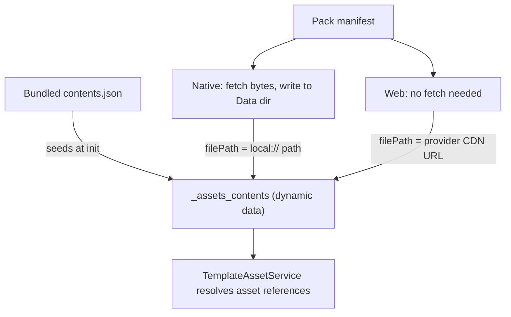

# Remote Assets

Remote assets let a deployment ship large media (images, audio, video) **outside** the app bundle and fetch it on demand, instead of bloating every install with files most users may never see. Content is grouped into named **asset packs** hosted in cloud storage; the app downloads a pack when a template asks for it, and from then on the asset resolves exactly like a bundled one.

The feature is a no-op unless the deployment opts in:

```ts
// deployment config
remote_assets: {
  provider: "supabase" | "firebase",
  bucketName: "my-bucket",  // supabase only; firebase uses firebase.config.storageBucket
  folderName: "assets",     // path prefix inside the bucket
}
```

Without `remote_assets.provider` the service sets `remoteAssetsEnabled = false`, registers the template actions so authors get an explanatory error rather than a silent no-op, and does nothing else.

## Files in this folder

| File | Responsibility |
| --- | --- |
| `remote-asset.service.ts` | Everything stateful: init, download orchestration, per-file fetch/save/integrate, resume |
| `remote-asset-metadata.service.ts` | Reads/writes pack status rows in the `_asset_packs` data list |
| `remote-asset.actions.ts` | The `asset_pack: *` template actions and their param parsing |
| `remote-asset.types.ts` | Shared types, the two protected data list names, and the storage folder name |
| `providers/` | `IRemoteAssetProvider` plus Supabase and Firebase implementations |

## The central idea: `_assets_contents`

Everything hangs off one dynamic data list, `_assets_contents`. `TemplateAssetService` reads it to turn an authored asset reference into a real path, and it does not care where a row came from.

At startup the list is seeded from the **bundled** (core) asset contents. Downloading a pack simply **overwrites rows in that same list** with paths that point at the newly available copies. That is why an author can write `my_image.png` without knowing whether it ships in the bundle or arrives from a pack — resolution is identical either way.



Note the platform split: **native downloads files, web does not.** On web the browser can stream straight from the provider's CDN, so a "download" only rewrites `filePath` to a public URL. All the filesystem, resume and integrity logic below is native-only.

### Local storage layout

On native, downloaded files are saved under a single folder within the deployment's storage:

```
Data/{deploymentName}/remote_assets/{manifest-relative path}
```

**Every pack shares that folder**, with files keyed only by their manifest-relative path — the same key `_assets_contents` uses. An asset shipped by more than one pack is therefore stored once, and the second pack's resume check finds it already downloaded instead of re-fetching it. The trade-off is that a stored file carries no record of which pack fetched it, which is why there is no per-pack delete (see *Known limitations*).

The deployment folder itself holds non-asset files too — the cached auth profile picture, for one — so deletion must always target the `remote_assets` subfolder, never the deployment folder.

### `filePath` is never an absolute device path

On native, a downloaded row stores `local://remote_assets/<manifest-relative path>` — never the absolute path the file currently sits at. iOS relocates the app container whenever the app is updated ([Apple TN2285](https://developer.apple.com/library/archive/technotes/tn2285/_index.html): *"the absolute path to the app's container [...] will change [...] you must only save paths to files relative to your application container"*), so an absolute path stored at download time goes stale on the next release and every downloaded asset silently stops rendering — while `_asset_packs` still reports the pack as `completed`, so nothing re-downloads to repair it.

`TemplateAssetService` therefore resolves `local://` paths **at the point of display**, against the container reported for the current session (`FileManagerService.getLocalAssetPathConfig`, handed over during `RemoteAssetService` init). Rows written by app versions that stored absolute paths are still understood: `getLocalAssetTargetPath` recovers the deployment-relative tail, so they re-point to the live container on next launch without needing a migration.

## Slots

A manifest row is one logical asset, but it can carry several files: the base file plus one override per theme/language combination. Each downloadable file is called a **slot** — one base slot (unless the entry is `overridesOnly`) plus one per override.

Slots matter because they are the unit of nearly everything: progress counts, download success/failure, and resume decisions are all per-slot, even though `_assets_contents` stores them together in a single row keyed by the base asset id (overrides nested under `overrides[theme][language]`).

## Download lifecycle

A pack's state lives in the `_asset_packs` data list, one row per pack, with a `download_status` of:

| Status | Meaning |
| --- | --- |
| `in_progress` | Actively downloading |
| `waiting_for_connection` | Offline; parked and will continue automatically when connectivity returns |
| `completed` | Every slot downloaded and integrated |
| `error` | Something failed; needs an explicit re-trigger |
| `cancelled` | The user/template cancelled it |

Execution is deliberately serial: **one pack at a time**, and within it either one archive or one file at a time (see *Two acquisition modes*). Requesting a second, different pack while one is active is refused (see *Concurrency* below). There is no download queue yet — a `TODO` in `downloadAndIntegrateAssetPack` tracks this.

A pack only reaches `completed` when **all** slots succeed. Per-slot failures are counted and returned as `failedCount`; a non-zero count throws, which either parks the pack (offline) or surfaces it as `error` (online). This matters: silently marking a pack complete with missing files leaves the app permanently referencing assets that will never arrive.

## Two acquisition modes

Fetching hundreds of files individually is dominated by round trips, not bytes: a 427-file pack is
854 sequential requests (each file costs a download-url lookup plus the download itself) to move
around 50MB, and completion time is set by the slowest few of them. So a pack that is mostly
missing is instead pulled as **one archive**, `{packName}.zip`, generated at sync time alongside
the manifest.

An archive cannot be the only mode, though, because it would undo what versioning bought: one
changed file in a 427-file pack would re-transfer the whole thing, where per-file fetching moves
only what actually changed.

So every download starts by checking each slot against local storage — the same resume gate
described below — and then picks:

| Missing | Mode |
| --- | --- |
| Nothing | Neither; re-integrate what is already on disk |
| More than 30% of the pack's **bytes** | Archive |
| 30% or less | Per-file, fetching only the missing slots |

The threshold is on bytes rather than file count. The trade is round trips against redundant
transfer, and packs mix ~85kb images with ~350kb audio, so a count misjudges it in both
directions — a handful of changed audio files looks small by count but large by bytes.

In practice that means **first install uses the archive, updates use per-file**, without either
being special-cased.

One case the threshold handles imperfectly: storage is shared across packs, so two packs shipping
some of the same files mean the second one finds part of itself already downloaded. If that still
leaves more than 30% of its bytes missing it fetches a full archive, most of which duplicates
files already on disk. The duplicated bytes are bounded by the overlap, and the alternative -
hundreds of individual requests - is usually worse, so this is accepted rather than solved.

### The archive

- **Fetched as a stream**, not a blob. Packs reach ~35MB compressed, and buffering the response
  only to copy it into an `ArrayBuffer` for decompression peaks at roughly twice that before any
  entry is inflated. Chunks are fed straight into the unzipper, so peak memory stays at a few
  chunks plus the single largest entry.
- **The URL carries the manifest version** (`...&v={version}`), on the fetch URL only — never in
  the storage key, which stays `{packName}/{packName}.zip`. This is correctness, not cache
  hygiene. Entries are verified only against the manifest that asked for them, so a CDN serving a
  stale archive would install outdated content and then record it at the *new* version, leaving
  the pack permanently wrong with nothing able to detect it. Stamping with the content hash keeps
  the archive cacheable while changing the URL exactly when the content changes. A manifest with
  no `version` therefore never uses the archive at all.
- **Entries already on disk are skipped without being decompressed.** Not calling `start()` on an
  entry leaves it compressed, which is the whole point of compressing selectively (below): on a
  bulk update most entries are present already.
- **Extracted entries are integrated directly, never through the per-file path.** That path skips
  its fetch only on evidence a *previous* run integrated the file, which freshly extracted bytes
  cannot have — so routing them through it would re-download every file just delivered.
- **Entry size is checked against the manifest.** fflate's read path neither verifies the
  per-entry CRC nor exposes it to the streaming API, so checking that would mean hand-parsing zip
  headers. In practice corruption shows up as a failing deflate stream, a size mismatch, or is
  ruled out by the version-stamped URL.

### When the archive does not work out

Falling back is per pack and lasts the session; none of it is persisted, since that would strand
a pack on the slow path after a couple of transient blips.

| Outcome | Behaviour |
| --- | --- |
| No archive published (404) | Per-file for this pack, and no re-probing for the rest of the session |
| Manifest has no `version` | Per-file; the URL cannot be made cache-safe |
| Offline / cancelled | Not an archive failure. Parked and retried like any other download |
| Stream truncated, corrupt, 5xx | Whatever arrived is kept, the shortfall is fetched per-file, and after two such failures the pack stops trying archives |

The shortfall case matters more than it sounds: entries are integrated as they arrive, so a failed
archive still leaves most of the pack on disk. The fallback re-reads the contents list and fetches
only what is genuinely still missing, rather than starting the pack over.

## Resume after interruption

Downloads run in the WebView's JS runtime, so killing or backgrounding the app kills the download. Recovery is *restart and skip what's already done*, not byte-range continuation.

**On launch**, any pack still sitting at `in_progress` or `waiting_for_connection` is picked up automatically — process death skips cleanup, so a stale status *is* the interruption signal. `error` and `cancelled` packs never auto-resume: the first waits for an explicit re-trigger (either `asset_pack` action will do, since `ensure_downloaded` only skips packs already `completed`), the second reflects user intent.

**Per slot**, the download is skipped only on *positive evidence* that a previous run finished this exact file. All three must hold:

1. The file exists on disk (`FileManagerService.getSavedFileInfo`), and
2. its size matches the manifest's `size_kb`, and
3. the `_assets_contents` entry recorded for that slot carries the manifest's checksum **and** has a `filePath` that is a local asset path.

Point 3 does the real work. Integrating a base asset writes the whole manifest entry, so the row also picks up every *override's* checksum before those files exist — a checksum alone would vouch for slots that were never downloaded, and only a rewritten `filePath` proves this app saved one. Manifest override entries carry a pack-relative path, which is never itself a local asset path, so the two stay distinguishable. Absolute paths from older app versions count as evidence too, so taking an update resumes rather than re-downloading every pack.

Anything unverified re-downloads. The cost of a false negative is one wasted file fetch; the cost of a false positive is a corrupt asset that never heals, so the gate is deliberately biased toward re-downloading.

**Not covered:** the on-disk bytes are never hashed. Web Crypto has no MD5, and hashing would only catch external corruption of an already-integrated file — out of scope for interrupt-resume, and better handled by a future `asset_pack: verify`/repair action that owns the MD5 dependency.

### Concurrency

Two different requests for the **same** pack join the same in-flight attempt rather than the second one failing — launch-time resume can easily race a template-triggered download for the same pack.

A request for a **different** pack while one is active is refused, but the two entry points differ in what happens next:

- **Background** (`awaitCompletion: false`, used by resume): the refused packs are retried once the active download settles, so the queue is not dropped.
- **Awaited** (`awaitCompletion: true`, the default for `ensure_downloaded`): returns `false` immediately. This is intentional — an awaited call blocks the template action queue, and a pack parked in `waiting_for_connection` can wait indefinitely, so it must not be able to wedge the queue behind unrelated work.

## Template API

```yaml
asset_pack: download | ensure_downloaded | cancel_download | reset
```

| Action | Behaviour |
| --- | --- |
| `download` | Download a single named pack, named either as an action arg (`asset_pack: download: my_pack`) or an `asset_pack` param, arg winning if both are given. Always runs, even if the pack is already `completed`, and always blocks the action queue until it finishes. Because it always re-walks the manifest, it is also the way to force an update check |
| `ensure_downloaded` | Download only packs not already `completed`. Takes `asset_pack` or `asset_pack_list` (array or JSON string), plus `await` (default `true`) to block the action queue or not, and `check_for_updates` (default `true`) |
| `cancel_download` | Abort all active downloads and mark them `cancelled`. Dispatched immediately rather than queued (see *Cancelling* below) |
| `reset` | Return **every** pack to its pre-download state: cancel active downloads (waiting for any in-flight write to finish), delete all downloaded files, and clear both data lists. All or nothing — if the files cannot be deleted the data lists are left alone, so the app keeps describing what is actually on disk and the reset can be retried |

### Debug options

#### Cancelling

A download holds the template action queue for its full duration, so a queued `cancel_download` would only run once the download it aborts had finished. It bypasses the queue instead, via `TemplateActionRegistry.registerImmediate`. Author it as the only action on its trigger, and not behind `trigger_actions`, or it is queued like anything else.

A cancel therefore lands mid-attempt, so `_asset_packs` status writes are serialised in `RemoteAssetMetadataService`, carry the attempt's abort signal, and treat `cancelled` as sticky until a later attempt starts. Serialising is the load-bearing part: `dynamicDataService.update` awaits internally before writing, so an `in_progress` write issued *before* the cancel could otherwise be applied *after* it — and a pack left `in_progress` is what resume treats as "restart me". Only `download_status` needs this; a stray count or file write after a cancel is harmless.

Cancelling aborts the loop, not the socket: the file request already in flight runs to completion and its result is discarded at the next checkpoint.

#### Artificial delay

Both `download` and `ensure_downloaded` accept `debug_download_delay_ms`, a manual testing aid that pauses for that many ms before each asset file — and, on the archive path, before each file extracted from it, so a first install is just as interruptible as a per-file download:

```yaml
asset_pack | download: my_asset_pack | debug_download_delay_ms: 3000
```

This exists to open a reliable window for interrupting a download — force-quitting the app mid-pack, toggling airplane mode — which is otherwise hard to hit on a fast connection. It defaults to `0`, is scoped to the single action call that sets it, and an unparseable value is ignored rather than breaking the download. Note the delay applies to *skipped* files too, so with it on a resume won't look faster: verify resume by status and counts reaching completion, not by speed. It does not slow the archive transfer itself, only extraction, so it opens a window during integration rather than during the download.

## Updating a published pack

Each manifest carries a `version`: a content hash over every asset's checksum, generated at sync
time in `AssetsPostProcessor`. It changes if and only if the pack's content changes, so it cannot be
forgotten the way a hand-maintained version number can.

`ensure_downloaded` uses it to decide **whether to look**, and nothing more. Once a pack is being
re-walked, which individual files get re-fetched is still decided by the per-slot resume gate above,
comparing checksums — so an update transfers bytes only for the files that actually changed.

The check compares for **inequality**, not "greater than". If a pack is rolled back, or a CDN serves
an older object, the app resyncs to whatever the bucket currently holds rather than being stuck
forever on content that no longer exists.

Rules worth knowing:

- **Checks never block the action queue**, whatever `await` says. `ensure_downloaded` guarantees a
  pack is *usable*, not that it is the latest; use `download` to block until latest.
- **A failed check never changes `download_status`.** A pack that is downloaded and working must
  not be made to look broken because a *check* failed. It stays `completed`, with the failure
  recorded in `version_check_status`.
- **Being offline records nothing at all** — not even a failed check. That keeps `"failed"` meaning
  "we reached the provider and something is wrong with the published pack", which is a far more
  actionable signal. Staleness shows up instead as `version_checked_at` failing to advance.
- **Checks are throttled** to once an hour per pack, or 15 minutes after a check that reached the
  provider and failed. `download` bypasses both. A pack with an update already known to be
  outstanding (`available_version` differs from `version`) is never throttled, so an update that
  failed, was cancelled, or never got its turn before the app was killed is retried on the next
  `ensure_downloaded` rather than an hour later. Retrying is cheap — the resume gate skips every
  file the previous attempt did manage to integrate.
- **A manifest with no `version` is left alone.** Packs published before versioning existed would
  otherwise be re-walked on every check forever.
- **`version` only advances on a fully successful download.** A partially applied update therefore
  stays at the old version and is retried by the next check; every asset still resolves in the
  meantime, since untouched files are the old version and updated ones were integrated as they went.
- **A failed or cancelled attempt on a pack that has completed before restores `completed`**, and
  leaves `version` untouched. This is not specific to updates — an explicit `download` that fails
  takes the same path, because the pack is equally still usable. One consequence: an update cannot
  be permanently dismissed by cancelling it; the next check past the throttle retries it. Use
  `check_for_updates: false` to stop a refresh recurring.

Progress during an update looks like a full re-download: each attempt resets
`assets_downloaded_count` to 0 and skipped files still count toward it, so a 200-file pack with one
changed file sweeps rapidly to 199 and then pauses on the single real fetch.

### Not covered by versioning

- **Files orphaned by an update.** If an entry is removed or renamed, its old file stays on disk —
  storage is flat and shared, so nothing can prove another pack does not still need it. Same blocker
  as per-pack delete (see *Known limitations*). Content changes overwrite in place, so this only
  arises from removals and renames.
- **`_assets_contents` rows for removed entries.** They keep pointing at a file that still exists,
  so the asset keeps resolving until `reset`. Worth knowing if you rely on a missing asset falling
  back to something else.
- **Web browser caching.** On web an updated file lives at the same CDN URL, so the browser may
  serve the old copy. Pre-existing, but versioning makes it visible.

Progress and status are exposed to authoring in two places:

- **`asset_pack_download_in_progress`** — a system variable holding a boolean string, for showing or hiding UI while any download is running. Referenced as `@fields._asset_pack_download_in_progress`, or as `@system.asset_pack_download_in_progress` in deployments using `useReactiveTemplates`.
- **The `_asset_packs` data list** — one row per pack, carrying the full `download_status` plus fine-grained counts (`assets_downloaded_count` of `assets_total_count`, in slots), `download_progress_percent`, and the start/completion timestamps. This can be consumed, for example, to drive a progress bar, i.e. via `data_items`.

`assets_downloaded_count` is always a genuine file count, whichever mode a pack used, so a display
reading "x of y files" stays truthful. It steps unevenly though, because pack files range from
under a kilobyte to a couple of megabytes — `download_progress_percent` exists for bars, and
tracks transferred bytes while an archive is streaming and files otherwise. Both reset per attempt
and are written to 100 / total on success even if throttling would have dropped the last update.

The same row carries the version and update-check state:

| Field | Meaning |
| --- | --- |
| `version` | Version at which every file was verified downloaded. `""` for packs downloaded before versioning existed |
| `available_version` | Version last seen remotely. `""` until a check has succeeded |
| `update_available` | A successful check found a remote version differing from the downloaded one |
| `has_completed_download` | The pack has reached `completed` at least once. Never cleared except by `reset` |
| `version_checked_at` | Last **successful** check |
| `version_check_attempted_at` | Last check **attempt**. Always `>=` `version_checked_at`, and strictly greater exactly when the last check failed |
| `version_check_status` | `"never"`, `"ok"`, or `"failed"` |

## Where packs come from

Asset packs are produced at sync time: assets destined for a pack are held out of the bundled app assets and written to `app_data/remote_assets/{packName}/` instead. Two config paths produce one:

- An entry in `google_drive.assets_folders` marked `remote: true` — the folder's `name` becomes the pack name.
- A Canto source folder with `remote_assets` entries — each declares a pack `name` plus a `condition` selecting which of that folder's files belong to it. Files matching no condition stay as core assets.

Each pack folder gets a `{packName}.json` manifest in `asset_pack` flow format, carrying every entry's `size_kb` and `md5Checksum` — the same metadata the resume gate later relies on. A `contents.json` is written alongside it in the standard core-asset format; only the manifest is fetched at runtime, so the extra file is not currently used but is harmless to include in upload. Pack folders are then uploaded to the configured bucket (currently a manual process), where the app expects:

```
{folderName}/{packName}/{packName}.json   <- manifest
{folderName}/{packName}/{packName}.zip    <- archive of every manifest slot
{folderName}/{packName}/{relativePath}    <- each asset file
```

`{packName}.zip` is written by the same code that writes the manifest, from the same data. That is
deliberate: an archive that has drifted from the loose files is a silent, whole-pack correctness
bug, and no upload runbook can prevent it. It contains exactly the manifest's slots, each asset's
base file immediately followed by that asset's own overrides — the app can only write a contents
row once every slot for it has arrived, so interleaved entries would mean nothing could be
recorded until the stream ended.

Text-like entries (`.svg`, `.json`, …) are deflated and everything else is stored. Packs are
dominated by already-compressed media, so blanket compression costs device CPU on extract for
almost nothing: on the largest real pack, deflating everything gives 33.5MB against 34.2MB for
text only, while making the device inflate 23MB of mp3 and png. **Unrecognised extensions are
stored**, so a newly-introduced media type is never inflated on device just because nobody added
it to a list.

The loose files are still needed — web resolves assets straight from them, and they are the
per-file download path.

**Upload assets and the archive first, the manifest last.** A manifest that lands before them
describes a version whose assets 404, so updates fail until the rest catches up. It is
self-healing — the recorded `version` does not advance, so the next check retries — but it looks
like a code bug.

Manifests are fetched with caching bypassed (`cache: "no-store"` plus a cache-busting query
parameter). Buckets typically serve long cache headers, and a cached manifest would report a stale
version, meaning updates silently never reach anyone — while still working perfectly on a fresh
install. Asset files are unaffected: they are fetched once and gated on checksums.

## Known limitations

- **No background continuation.** Downloads stop when the app is backgrounded or killed and resume on next launch. Continuing while backgrounded needs a native downloader plugin and is not implemented.
- **No download queue, and no parallelism within a pack.** One pack at a time, and the per-file path fetches one file at a time. Bulk downloads avoid the cost by pulling an archive instead, but a pack that falls back to per-file (no archive published, or an unversioned manifest) is still slow.
- **No integrity repair.** There is no way to detect or fix an already-integrated file that was corrupted after the fact.
- **No per-pack delete.** Storage is reclaimed all at once via `reset` or not at all. Because files are stored flat and may legitimately be shared by two packs, deleting a single pack would need a record of which files it fetched — see the options weighed on `spike/remote-asset-storage-migration`.
- **Files downloaded before the `remote_assets/` folder existed are orphaned.** Older builds saved straight into the deployment folder, so those files are neither found by the resume gate (each affected pack re-downloads once) nor reclaimed by `reset`, which only touches `remote_assets/`. Accepted as a one-off cost on the small number of existing installs; a cleanup migration is prototyped on the same spike branch.
- **Two packs shipping the same path with different content conflict.** They share one `_assets_contents` row and one stored file, so whichever downloads last wins. Worth a build-time warning if packs are ever authored with overlapping paths.
- **Updates can orphan files.** Removing or renaming a manifest entry leaves its old file on disk, and its `_assets_contents` row still resolving, until `reset`. See *Not covered by versioning* above.
- **Web assets can be served stale from browser cache after an update**, since the CDN URL does not change with content. Cache-busting web `filePath` values on `md5Checksum` would fix it and is a candidate follow-up.
